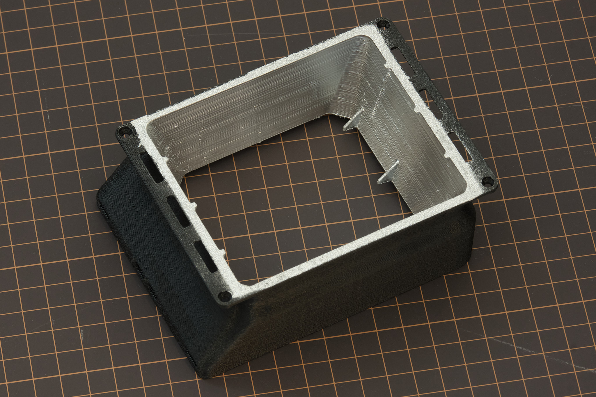

# parts list

## 3d printing notes
Print all parts in black ABS or ASA, using a 0.4mm or 0.6mm nozzle with 4 or 3 perimeters, respectively, 0.2mm layer height, and 30% infill. Fuzzy skin may be used on external contours only (**NOT** the painted interior surfaces of the diffuser box.) Printing orientation for all parts should be obvious based on the design. The "Support on Build Plate Only" or equivalent option should be used since several parts have counterbore holes.

## painting notes
The interior surfaces of the diffuser box housing must be painted with 2-3 coats of paint containing only extra fine leafing aluminum flake pigment, such as Dupli-Color CS101 or Rust-Oleum 7718830. The surface of the 3D printed part does not need to be meticulously prepared before painting; lightly scuffing the surface with Scotch-Brite or a brass wire brush is enough. Spray paints containing acetone or toluene can be used on ABS or ASA without primer. Painting this way will make any imperfections in the 3D print extremely visible; don't worry about it.

Alternatively, the inside of the diffuser housing can be covered in aluminum foil tape. This can work relatively well if done carefully, but may not reach the same level of brightness uniformity as painting. Sanding the surface of the tape with ~300 grit sandpaper before applying it is recommended to reduce specular reflections.

## scanlight v4

[assembly instructions](./scanlight%20v4/assembly_instructions.md)

### scanlight v4 only
* assembled PCB
* front diffuser (4x3.25x0.118" ACRYLITE® Satinice WD008 DF light-diffusing acrylic, or standard white acrylic with <50% light transmittance)
* 26A101D 3D printed diffuser box housing (use variant E for horizontal mounting option)
* 26A103B 3D printed diffuser bezel
* 26A104 3D printed button (may be printed in other materials than ABS)
* 26A105 3D printed PCB cover
* 2x M2x10mm pan head self-tapping screw for plastic (head diameter 4mm or less)
* 4x 8mm diameter adhesive-backed rubber bumper (3M SJ5370 or equivalent)

### optional
* 26A110 3D printed tonecarrier compatibility plate
* 26A111 3D printed valoi 360 advancer compatibility plate

*Note: if printing ToneCarrier/Valoi compatibility parts, double-check that the dimensions of the STEP file match the accessory you are using it with. Dimensions of these third-party products may change without notice.*

## big scanlight

[assembly instructions](./big%20scanlight%20v1/assembly_instructions.md)

### big scanlight only
* assembled driver PCB
* assembled LED PCB
* front diffuser (4.5x5.5x0.118" ACRYLITE® Satinice WD008 DF light-diffusing acrylic, or standard white acrylic with <50% light transmittance)
* 25D101 3D printed diffuser box housing (**use variant B for r1 LED PCB, variant C for r2 LED PCB**)
* 25D103A 3D printed diffuser bezel
* 25D104 3D printed backplate
* 25D105B 3D printed PCB cover
* 25D107 3D printed button (may be printed in other materials than ABS)
* 2x M2x10mm pan head self-tapping screw for plastic (head diameter 4mm or less)
* 4x M3x8mm pan head self-tapping screw for plastic (head diameter 6.5mm or less)
* 4x 12mm diameter, 4mm tall adhesive-backed rubber bumper

### optional
* 25D108 3D printed film carrier compatibility plate (**use variant B for film carriers made starting May 2026, variant A otherwise**)
* 25D110 3D printed tonecarrier compatibility plate
* 25D111 3D printed valoi 360 advancer compatibility plate

### valoi easy120 integration
* **replace** 25D103**A** with 25D103**B** 3D printed diffuser bezel (screw mount variant)
* 25D112 3D printed valoi easy120 baseplate
* 25D113 3D printed valoi easy120 mounting block
* 4x M3x20mm socket head cap screw
* 4x M3 heat-set insert (5mm diameter, 4-5mm length)

*Note: if printing ToneCarrier/Valoi compatibility parts, double-check that the dimensions of the STEP file match the accessory you are using it with. Dimensions of these third-party products may change without notice.*

## accessories

Current film carrier design files are in the [film carriers v1.1 folder](./film%20carriers%20v1.1/).

### 35mm film carrier

* 2x 25C012 3D printed 35mm film carrier half
* 25C011 3D printed 35mm mask
* 25C020 3D printed 35mm half frame mask (optional)
* 25C018A 3D printed 35mm film carrier hood
* 2x M2x10mm pan head self-tapping screw for plastic
* 4x 4mm diameter x 2mm thick N52 neodynium magnet (optional since May 2026)

### medium format film carrier

* 2x 25C013 3D printed medium format film carrier half
* 25C014 3D printed 6x8 mask (optional)
* 25C015 3D printed 6x7 mask (optional)
* 25C016 3D printed 6x6 mask (optional)
* 25C017 3D printed 6x4.5 mask (optional)
* 2x M2x10mm pan head self-tapping screw for plastic (head diameter 4mm or less)
* 4x 4mm diameter x 2mm thick N52 neodynium magnet (optional since May 2026)

### scanlight v2/v3/v4 horizontal mount

*camera_height* is the vertical distance in millimeters between the bottom flat surface of your camera's Arca-Swiss quick release plate and the central axis of the lens.

* 20x20mm T-slot aluminum extrusion at least 350mm long, depending on close focusing ability of your lens
* 25C032 3D printed diffuser mount
* 25C034 3D printed camera clamp slider
* 25C035 3D printed camera clamp cleat
* 25C036 3D printed camera clamp cam
* 25C037 3D printed M3x1mm spacer (quantity = 4 * (*camera_height* - 37))
* 4x M3 socket head cap screw (length = 12 + (*camera_height* - 37) +/- 2 mm)
* M3 washers (as needed)
* 4x M3 heat-set insert (5mm diameter, 4-5mm length)
* 2x M3x8mm socket head cap screw
* 2x M3 T-slot nut for 2020 aluminum extrusion
* 1x M5x8mm button head cap screw
* 1x M5x12mm socket head cap screw
* 2x M5 T-slot nut for 2020 aluminum extrusion

## old versions (for reference only, do not build)

### scanlight v2/v3 only
* assembled PCB
* front diffuser (4x3x0.118" ACRYLITE® Satinice WD008 DF light-diffusing acrylic, or standard white acrylic with <50% light transmittance)
* 3D printed PCB baseplate
* 3D printed diffuser box housing
* 3D printed diffuser bezel
* 4x 6mm diameter x 3mm thick N52 neodynium magnet (if using magnetically attached film carriers)
* 8x M2x6mm pan head self-tapping screw for plastic (head diameter 4mm or less)
* 4x 8mm diameter adhesive-backed rubber bumper (3M SJ5370 or equivalent)

Note: the reflector box housing and diffuser bezel are available in two variants, screw-together and snap-fit. The snap-fit versions are designed specifically to print in ABS on a very well-tuned printer with a heated chamber; good results are not guaranteed otherwise.

