# A Better Light Source For Scanning Color Negative Film

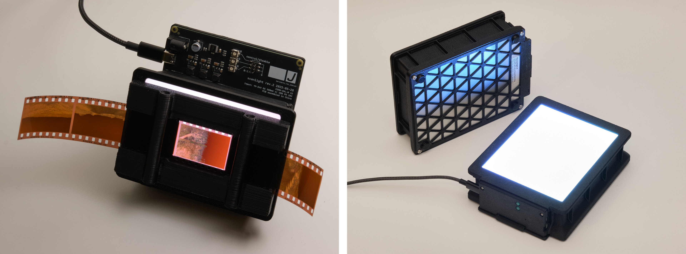

Left: [scanlight v3](./hw_v2.md), right: [big scanlight](./big.md)

<small>Originally published 2024-08-05, last updated 2025-12-11 (big scanlight)</small>

## tl;dr

Narrowband trichromatic (RGB) light sources are superior to broadband (white) light for scanning color negative film; there are very good reasons why all commercial film scanners use RGB. ([film scanners were using blue LEDs at least a decade before they would be widely used in consumer products!](https://patents.google.com/?q=(film+scanner+LED)&oq=film+scanner+LED)) Scanning film with an RGB light source produces high quality results with minimal post-processing, without the need for specialized software.

### the results

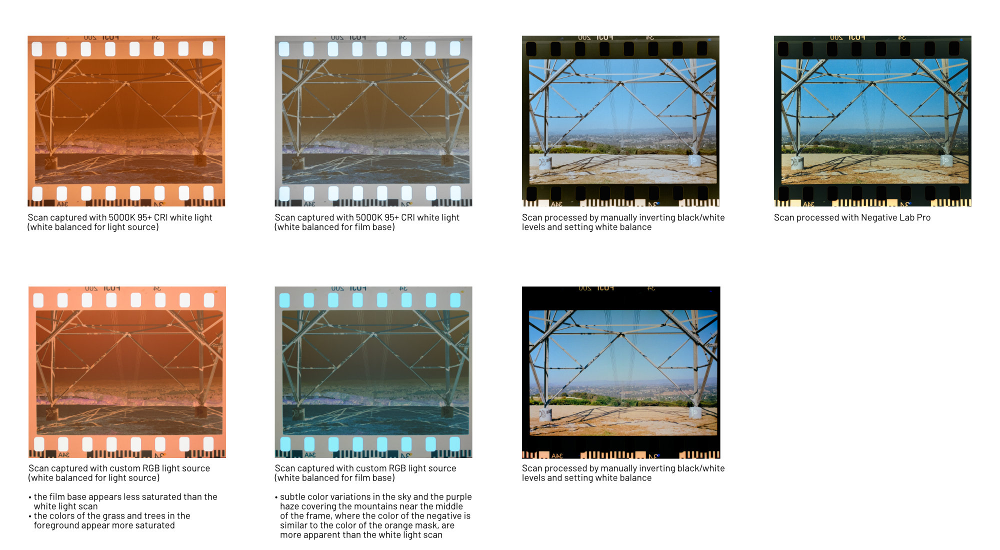

<small>Both scans captured using Fujifilm X-T30. White light scan captured using 95+ CRI 5000K light source. RGB scan captured using custom 450nm+525nm+665nm light source.</small>

### responses to frequent comments and questions

##### but i can just edit the white light scan to look like the RGB scan
You can't get the exact same colors as the RGB scan by adjusting the white balance or individual color channels of a white light scan; the comparison image above has been updated to emphasize this. In fact, this is physically impossible because **the light interacted with the film in a fundamentally different way** in the white light scan vs. the RGB scan before it was reduced to three bins of wavelengths approximately representing red, green, and blue by the camera sensor.

##### but the colors in the sample scan(s) still don't look good to me
Getting the desired colors from C-41 film, whether by darkroom printing or scanning and editing, has always involved some level of manual adjustment. **Photography is art, and as such it has always involved making subjective decisions about how images should look; all photos are interpretations of raw data and it's up to the photographer to decide what interpretation looks best.** The best starting point for editing is a scan that represents the image data stored in the dye layers of the film with maximum dynamic range and minimal crosstalk.

##### but the way you inverted the negatives isn't technically correct
I think it's safe to say that most photographers shooting film in 2024 are looking for *aesthetically pleasing* colors, not *technically perfect* colors. If you have a more technically accurate way to process your scans, then by all means use it (also, write an article about it or build open-source software to automate the process!); but using a narrowband light source instead of a white light source will still get you closer to the results from a professional scanner.

##### but won't this make all film look the same?
Scanning film with RGB light does **not** neutralize the differences in the 'look' of different films; actually, it should produce results that are much closer to the intended look of the film when printed on RA-4 paper. The differences in look come from differences in the film's sensitivity to light during exposure and chemical interactions that affect how the dyes are formed during development, not the absorption characteristics of the dyes themselves. It is also worth mentioning that many people have preconceived ideas of what film *should* look like that are based on highly edited or low-quality scans; old, faded prints; or even software emulations.

## the simplified explanation

Color negative (C-41) film stores an image using cyan, magenta, and yellow dyes. Dyes appear a certain color because they absorb some wavelengths of light; for example, yellow dye mostly absorbs light in the 400-550nm range (which we perceive as violet through green), while allowing other wavelengths (yellow through red) to pass through the film. **These dyes are not intended to produce a human-viewable image, but rather to attenuate certain wavelengths of light for making prints on photosensitive paper.**

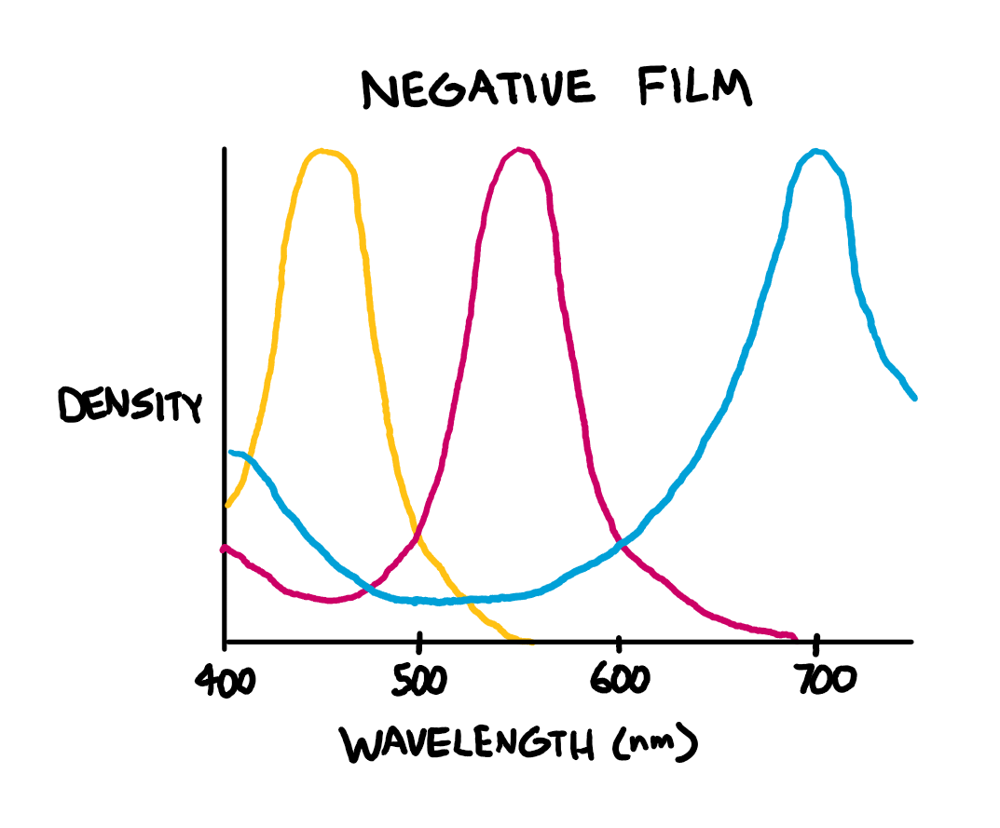

White light sources emit light over a broad spectrum of wavelengths. When white light passes through C-41 film, some of these wavelengths are only slightly absorbed by two or all three of the dyes, which means that these wavelengths aren't useful for recovering the information stored in the individual dye layers - for example, the 580-620nm band (yellow through red-orange light) is mostly transmitted through the film, with a small amount being absorbed by both the magenta and cyan dye layers.

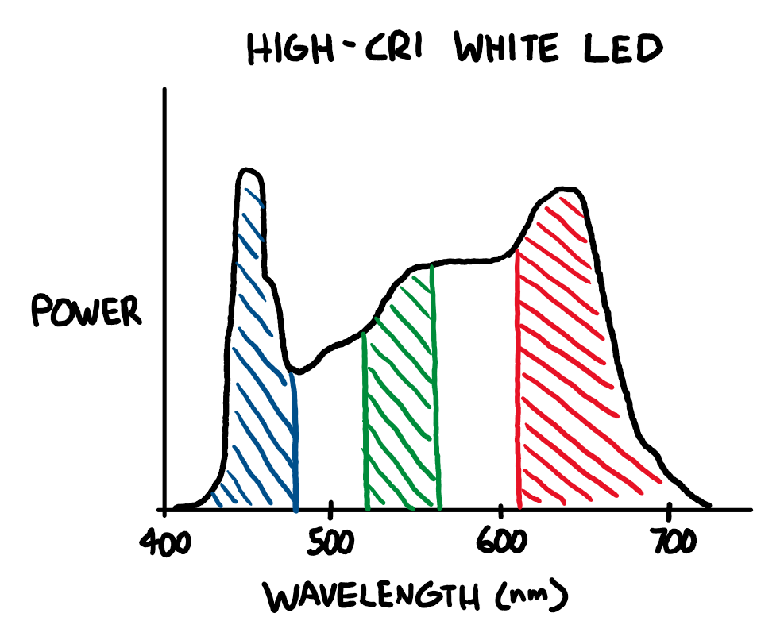

With darkroom printing, this is not an issue, as RA-4 color print paper (and motion picture print film) are, by design, most sensitive to specific bands of wavelengths that avoid these 'overlaps' between the dye layers in negative film.

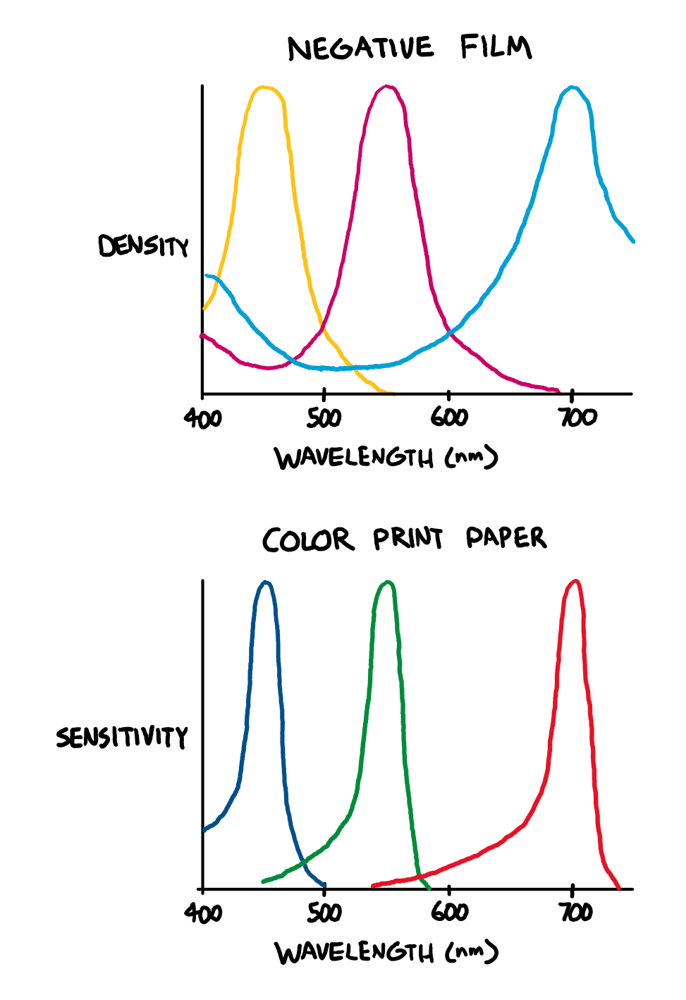

What about scanning film with a digital camera? Digital camera sensors are designed to capture light in a way that allows for a faithful reproduction of the colors that humans would perceive (this is a gross oversimplification.) C-41 film was *not* designed to be directly viewed by humans.

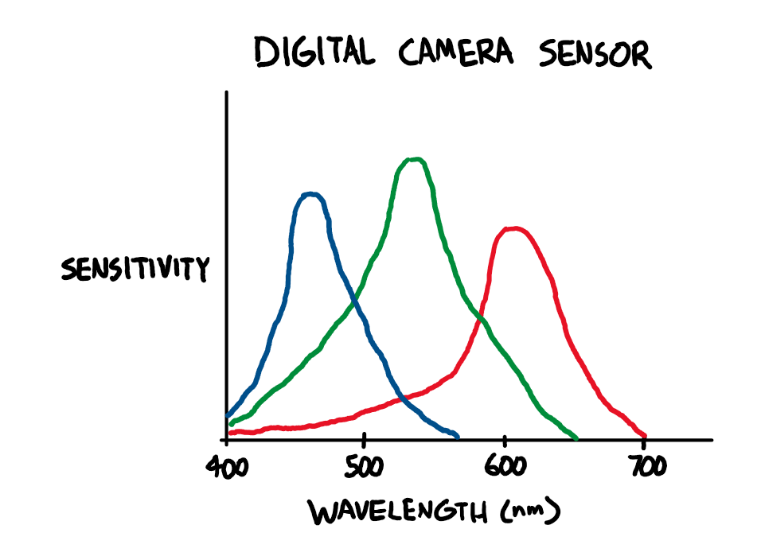

Not only is the camera sensitive to wavelengths of light that are effectively ignored by RA-4 paper, there is significant overlap between the color channel sensitivities of digital camera sensors: light in the ~580-600nm range is sensed by both the red and green channels, and light in the ~480-500nm range is sensed by both the green and blue channels.

Because the overall light transmission of C-41 film is heavy biased towards yellow and orange wavelengths due to the orange mask, this means that **a lot** of light gets through that interferes with both the red and green channels in the camera sensor. The red channel of the scan will contain not just information from the red-blocking cyan dye, but also the green-blocking magenta dye. The green channel will contain information from all three dye layers.

<small>note: the orange color of C-41 film is often misunderstood to be part of the film base, or an orange tint evenly applied over the whole image. It is actually a corrective mask made up of yellow and magenta positive images.</small>

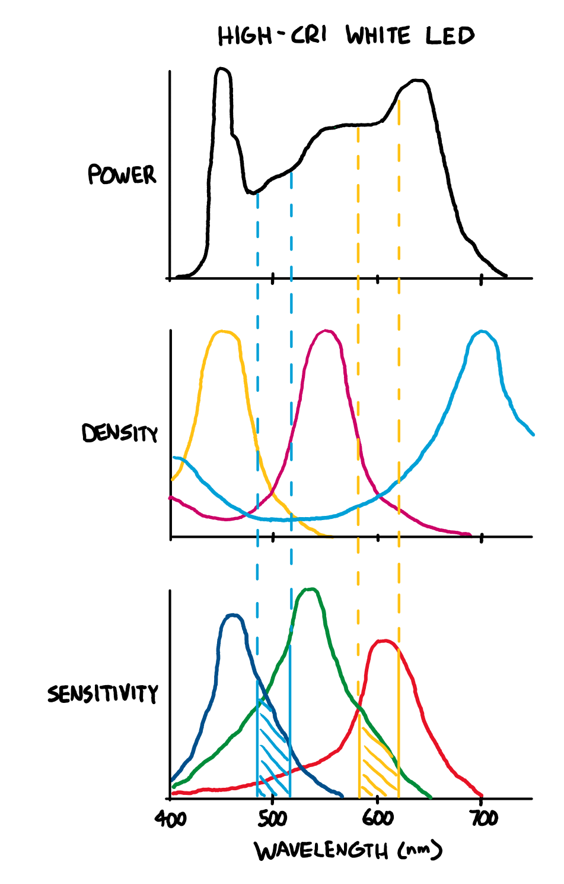

So if you scan color negative film with white light, you can't just invert the colors and expect a good result. You need to do some math to try to recover the individual dye layers of the film from ambiguous input data. This can't be done in standard image editing software, which is why dedicated software for negative conversion exists. This process will require extensive tuning for every combination of camera and light source used, and the color depth of the resulting positive image will be relatively low because **much of the information recorded by the camera is effectively useless yellow-orange light that has passed through the film without being significantly attenuated by any of the dyes**.

To avoid these issues, (almost?) all commercial negative film scanners use a trichromatic narrowband light source with red, green, and blue LEDs to minimize overlap between the dye layers in the film. When doing it this way, no software trickery is needed to recover an image and it's really as simple as inverting the color channels and setting the color balance and black/white points.

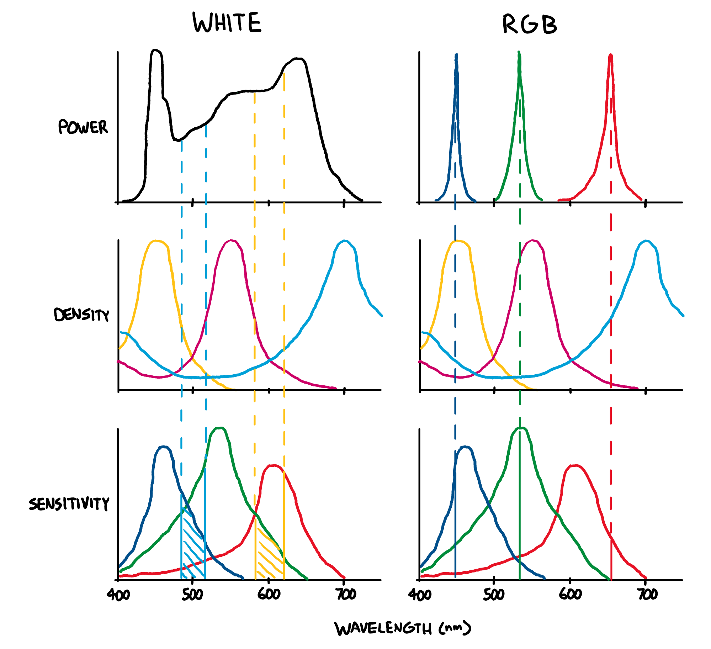

### so what LEDs should I use?

When considering the limitations of digital camera sensors, the ideal wavelengths are >650nm for red, 520-550nm for green, and <450nm for blue, as shown in the diagram above. However, to the best of my knowledge, there aren't any commercially available light sources combining LEDs of these wavelengths, so the only way (for now) to get an ideal light source is to build one yourself, which is discussed in the next section of this article.

The next best alternative is to use general purpose RGB LEDs, which typically use 620-630nm for red and 460-480nm for blue. The results will not be the absolute best possible, but will still be far better than with white light. The Fuji Frontier SP3000, a popular professional scanner, uses 630nm for red and 465nm for blue ([source](https://discuss.pixls.us/t/input-color-profile-to-use-for-negatives/20271/13)), but it does not have to contend with the color channel sensitivity of a typical digital camera - it has a monochrome image sensor and combines three exposures taken with red, green, and blue light.

If going this route, I would recommend placing an array of RGB LED strips or an off-the-shelf RGB video light panel behind a diffuser made from some combination of diffusing film and white or matte clear acrylic sheets to get the most even illumination possible.

### what about other light sources?

OLED displays do contain separate red, green, and blue emitters, but they typically have broader emission spectra than inorganic LEDs. They will produce results that are significantly better than a white light source, but not as good as RGB LEDs.

LCD displays emit white light that has been filtered through red, green, and blue filters and recombined. The results will depend on the emission spectrum of the exact display used and should be better than a white light source and worse than RGB LEDs. Newer high-gamut LCDs use special backlight LEDs designed to emit in narrower bands than typical white LEDs, so they should in theory work significantly better than older ones.

White light is still ideal for scanning positive (slide) film, which is designed to be viewed directly when illuminated with a broad spectrum light source like an incandescent lamp. Scanning slide film with a narrowband light source and bayer image sensor results in unnaturally saturated colors with especially poor rendering of reds, oranges, and skin tones, so I don't recommend it. Achieving good results when scanning slide film using narrowband illumination would require combining individual scans of each color channel using an image processing pipeline that somehow maps the dye spectral density curves to the RGB color space, and I don't think this exists yet at least for hobbyist use.

### scanning film with RGB

When scanning film with a narrowband light source, it's easy to get good results without using any specialized software. Using software designed for processing white light scans to process RGB scans may give suboptimal results.

#### my scanning and processing workflow
##### 1. scan
Scan all frames as RAW using fixed white balance and exposure. Exposure should be set such that none of the color channels are clipping.
##### 2. import
Import scans into image editing software. **Use a linear RAW profile.** Apply lens corrections if necessary. Use Lens Cast Calibration in Capture One or Flat-Field Correction in Lightroom to compensate for any unevenness in the light source.
##### 3. d-min balance
Neutralize the color of the minimum density (unexposed) areas of one negative, either by adjusting the white balance, adjusting the red, green, and blue channel max levels, or both.
##### 4. inversion
Invert the black and white points using the Levels or Curves tool and apply an appropriate curve to set the brightness of the output image.
##### 5. fine tuning
Apply these adjustments to all scans from the same roll of film. Manually fine-tune the black and white points, and if necessary, white balance or curves for all scans.

### more sample scans

Each group of four negatives were scanned and processed together in order to demonstrate how the light source affects the overall look of the scans rather than to show a subjectively ideal edit for each photo. Minimal post-processing was done to all scans (import image with linear raw profile, invert, color balance, apply tone curve). The same tone curve was used for all scans.

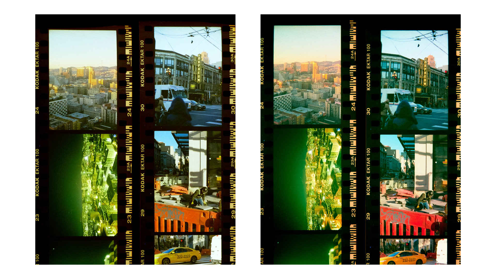

<small>Kodak Ektar 100 (left: white light, right: narrowband RGB light)</small>

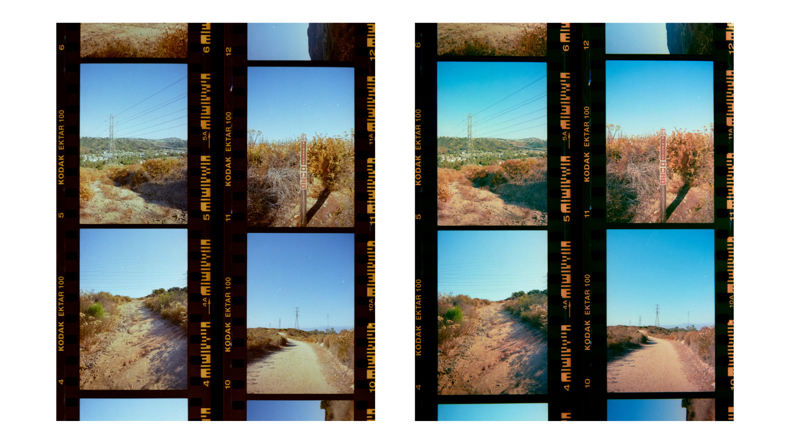

<small>Kodak Ektar 100 (left: white light, right: narrowband RGB light)</small>

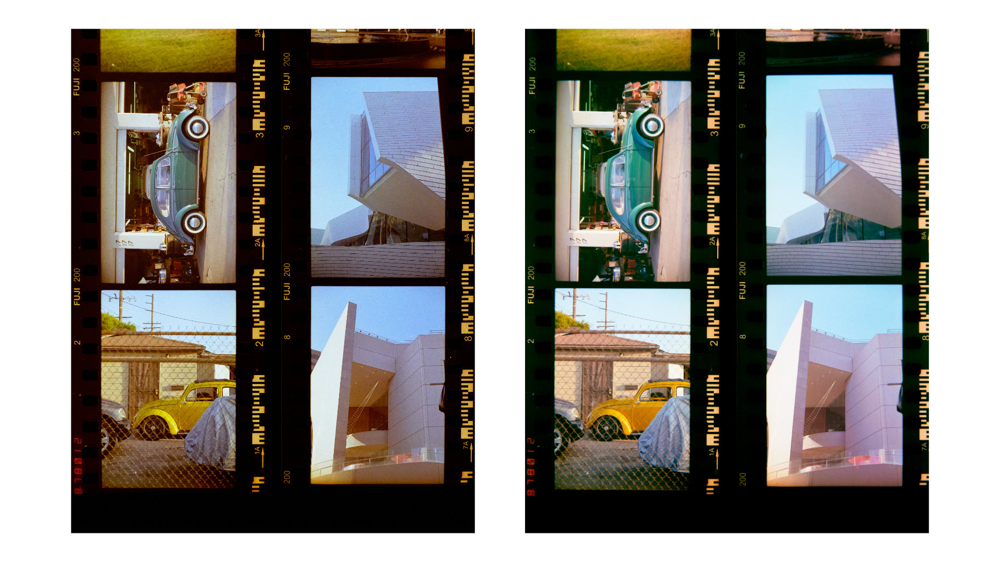

<small>Fuji 200 (left: white light, right: narrowband RGB light)</small>

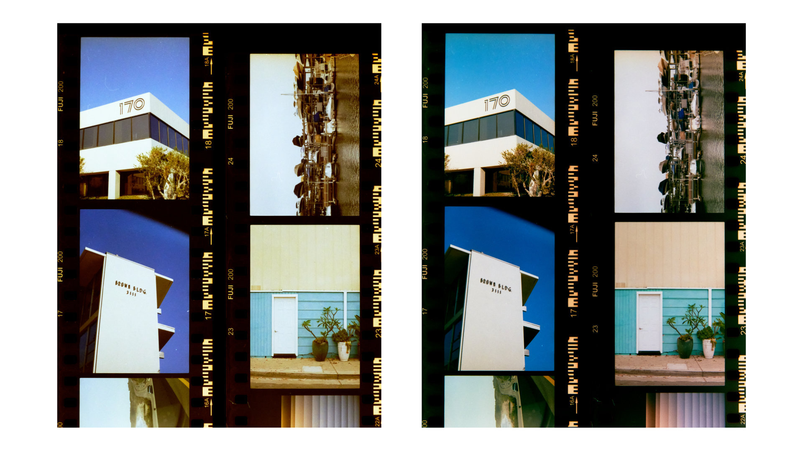

<small>Fuji 200 (left: white light, right: narrowband RGB light)</small>

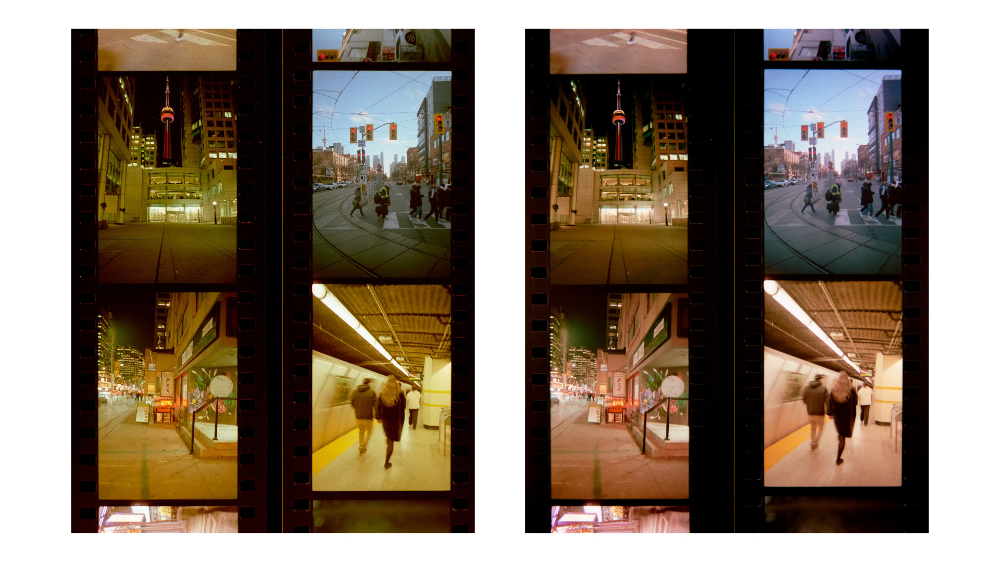

<small>Kodak Aerocolor IV 2460 (left: white light, right: narrowband RGB light)</small>

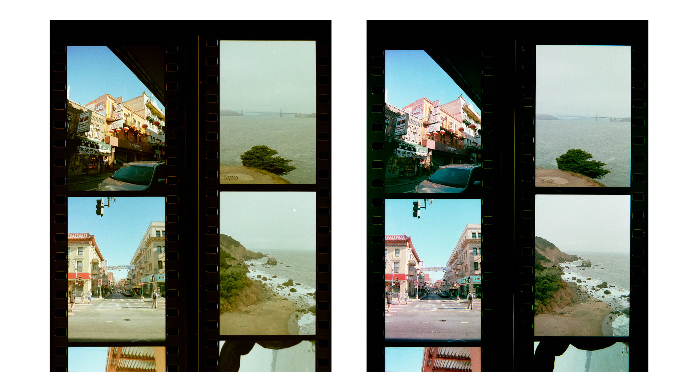

<small>Kodak Aerocolor IV 2460 (left: white light, right: narrowband RGB light)</small>

### recommended reading, if you're curious

* Edward J Giorgianni and Thomas E Madden, *Digital Color Management: Encoding Solutions, 2nd Edition*
* Robert L Shanebrook, *Making Kodak Film*

## part 2: the hardware

<small>Updated 2025-12-11</small>

To get the best possible results, I designed my own custom RGB light sources. More information on the designs can be found [here (scanlight v3)](./hw_v2.md) and [here (big scanlight)](./big.md).

All design files for the light sources and film carriers can be downloaded from the [GitHub repository](https://github.com/jackw01/scanlight/).

## license

The PCB schematic, layout, and Gerber files and the 3D CAD files for this project are released under the [CERN Open Hardware Licence Version 2 - Weakly Reciprocal](https://choosealicense.com/licenses/cern-ohl-w-2.0/) (CERN-OHL-W V2). Software and firmware are released under the MIT License. The text and illustrations in this article may not be reproduced without permission.
