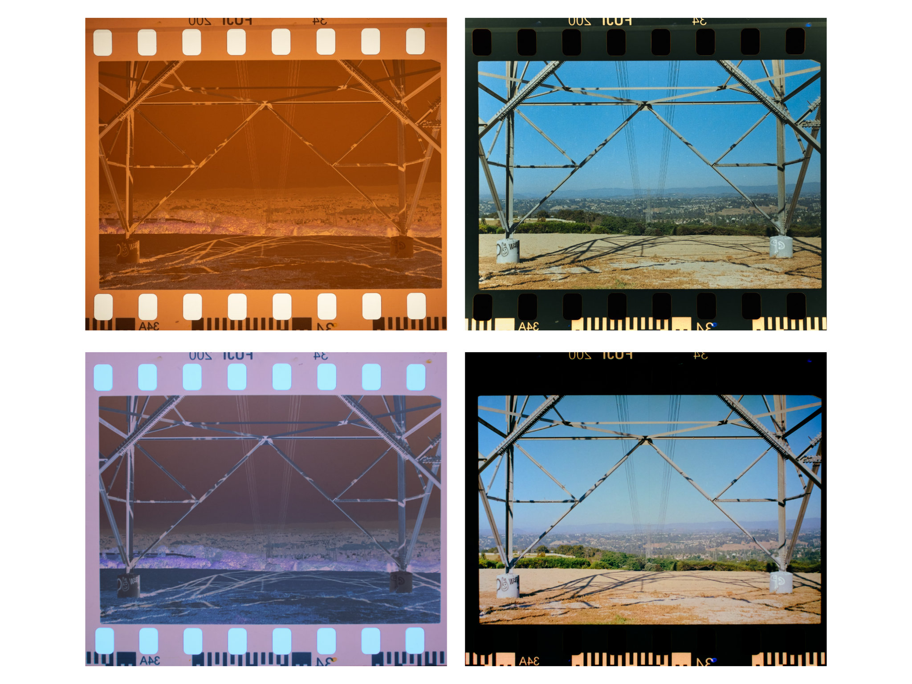
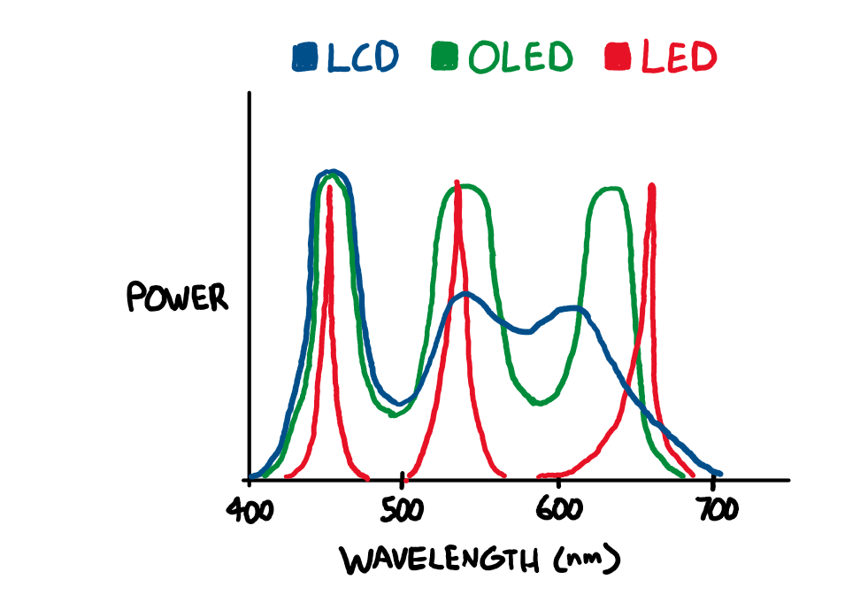
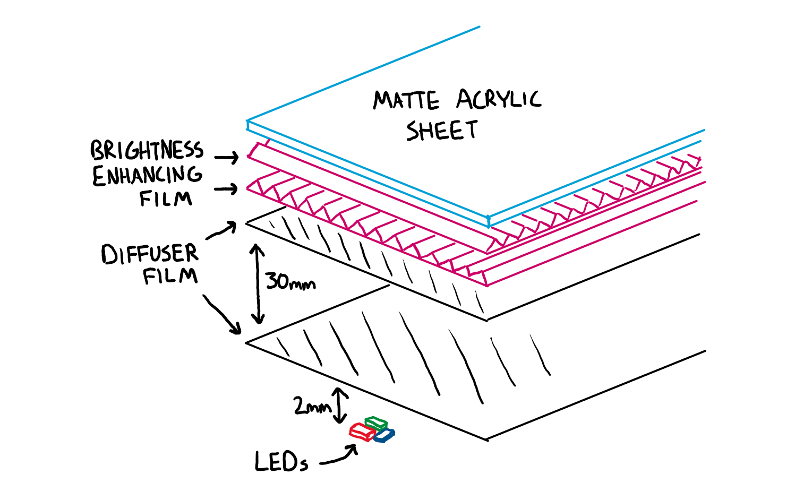

# A Better Light Source For Scanning Color Negative Film

[need image]

## tl;dr

Narrowband trichromatic (RGB) light sources are superior to broadband (white) light for scanning color negative film; there are good reasons why all commercial film scanners use RGB. Scanning film with an RGB light source produces high quality results with minimal post-processing, and without any specialized software.

### the proof

From top to bottom, left to right:

* original white light scan
* positive image produced from white light scan using leading color negative conversion software
* original RGB scan
* positive image produced from RGB scan by inverting colors and setting black/white levels in general purpose photo editing software

## the simplified explanation

Color negative (C-41) film stores an image using cyan, magenta, and yellow dyes. Dyes appear a certain color because they absorb some wavelengths of light; for example, yellow dye mostly absorbs light in the 400-550nm range (which we perceive as violet through green), while allowing other wavelengths (yellow through red) to pass through the film. **These dyes are not intended to produce a human-viewable image, but rather to attenuate certain wavelengths of light for making prints on photosensitive paper.**

White light sources emit light over a broad spectrum of wavelengths. When white light passes through C-41 film, some of these wavelengths are only slightly absorbed by two or all three of the dyes, which means that these wavelengths aren't useful for recovering the information stored in the individual dye layers - for example, the 580-620nm band (yellow through red-orange light) is mostly transmitted through the film, with a small amount being absorbed by both the magenta and cyan dye layers.

With darkroom printing, this is not an issue, as RA-4 color print paper (and motion picture print film) are, by design, most sensitive to specific bands of wavelengths that avoid these 'overlaps' between the dye layers in negative film.

What about scanning film with a digital camera? Digital camera sensors are designed to capture light in a way that allows for a faithful reproduction of the colors that humans would perceive (this is a gross oversimplification.) C-41 film was *not* designed to be directly viewed by humans.

Not only is the camera sensitive to wavelengths of light that are effectively ignored by RA-4 paper, there is significant overlap between the color channel sensitivities of digital camera sensors: light in the ~580-600nm range is sensed by both the red and green channels, and light in the ~480-500nm range is sensed by both the green and blue channels.

Because the overall light transmission of C-41 film is heavy biased towards yellow and orange wavelengths due to the orange mask, this means that **a lot** of light gets through that interferes with both the red and green channels in the camera sensor. The red channel of the scan will contain not just information from the red-blocking cyan dye, but also the green-blocking magenta dye. The green channel will contain information from all three dye layers.

<small>note: the orange color of C-41 film is often misunderstood to be part of the film base, or an orange tint evenly applied over the whole image. It is actually a corrective mask made up of yellow and magenta positive images.</small>

So if you scan color negative film with white light, you can't just invert the colors and expect a good result. You need to do some math to try to recover the individual dye layers of the film from ambiguous input data. This can't be done in standard image editing software, which is why dedicated software for negative conversion exists. This process will require tuning for every combination of camera and light source used, and the color depth of the resulting positive image will be relatively low because **much of the information recorded by the camera is effectively useless yellow-orange light that has passed through the film without being significantly attenuated by any of the dyes**.

To avoid these issues, (almost?) all commercial negative film scanners use a trichromatic narrowband light source with red, green, and blue LEDs to minimize overlap between the dye layers in the film. When doing it this way, no software trickery is needed to recover an image and it's really as simple as inverting the color channels and setting the color balance and black/white points.

### so what LEDs should I use?

When considering the limitations of digital camera sensors, the ideal wavelengths are >650nm for red, 520-550nm for green, and <450nm for blue, as shown in the diagram above. However, to the best of my knowledge, there aren't any commercially available light sources combining LEDs of these wavelengths, so the only way (for now) to get an ideal light source is to build one yourself, which is discussed in the next section of this article.

The next best alternative is to use general purpose RGB LEDs, which use 620-630nm for red and 460-480nm for blue. The results will not be the absolute best possible, but will still be far better than with white light. The Fuji Frontier SP3000, a popular professional scanner, uses 630nm for red and 465nm for blue ([source](https://discuss.pixls.us/t/input-color-profile-to-use-for-negatives/20271/13)), but it does not have to contend with the color channel sensitivity of a typical digital camera - it has a monochrome image sensor and combines three exposures taken with red, green, and blue light.

If going this route, I would recommend placing an array of RGB LED strips or an off-the-shelf RGB video light panel behind a diffuser made from some combination of diffusing film and white or matte clear acrylic sheets.

### what about other light sources?

OLED displays do contain separate red, green, and blue emitters, but they typically have broader emission spectra than inorganic LEDs. They will produce results that are significantly better than a white light source, but not as good as RGB LEDs.

LCD displays emit white light that has been filtered through red, green, and blue filters and recombined. The results will depend on the emission spectrum of the exact display used and should be better than a white light source and worse than RGB LEDs.

White light is still ideal for scanning positive (slide) film, which is intended to be projected with white light. However, a narrowband light source may still be helpful for recovering colors from faded slide film.

## scanning film with RGB

When scanning film with a narrowband light source, it's easy to get good results without using any specialized software. Using software designed for processing white light scans to process RGB scans may give suboptimal results.

### scanning and processing workflow
1. Scan all frames using fixed white balance and exposure. Exposure should be set such that none of the color channels are clipping.
2. Import scans into image editing software and apply lens corrections as if necessary. Optionally, use Lens Cast Calibration in Capture One or Flat-Field Correction in Lightroom to compensate for any unevenness in the light source.
3. Invert the black and white points for all scans using the Levels tool.
4. Manually correct the white balance on one scan, then apply to all scans from that roll of film. Check other scans and make adjustments as necessary.
5. Fine-tune the black and white points and gamma for each scan using the Levels tool.
6. Make other edits as desired.

### recommended reading, if you're curious

* Edward J Giorgianni and Thomas E Madden, *Digital Color Management: Encoding Solutions, 2nd Edition*
* Robert L Shanebrook, *Making Kodak Film*

## part 2: the hardware

All design files can be downloaded from the [GitHub repository](https://github.com/jackw01/scanlight).

### the light source

The light source uses six each of deep red (660nm), green (525nm), and royal blue (450nm) 2835 package LEDs, with adjustable brightness for each color channel. The LEDs are driven by [Diodes Incorporated AL8860](https://www.diodes.com/assets/Datasheets/AL8860.pdf) constant current buck drivers.

[need image]

[need image]

[Schematic as PDF](pcb/schematic%20rev1%2020240802-01.pdf)

[Bill of Materials](pcb/bom%20rev1%2020240802-01.pdf)

#### build notes

The PCB should be fabricated with black soldermask to prevent reflections off the soldermask or fluorescence of the substrate material from affecting the emitted light.

Either a 19-24V barrel jack AC adapter or a 20V-capable USB PD supply as a power source; if using an AC adapter, J2???, U?, R?, C? do not need to be installed. At the time of writing, all components can be sourced from DigiKey except for the IP2721 USB Power Delivery IC.

Be aware that not all 2835 LEDs, even ones from the same manufacturer, have the same polarity. If using alternative LEDs, be sure to check the datasheet before installing.

### the diffuser

To diffuse the light, I designed a 3D printed enclosure to house a stack of optical films similar to what is found in the backlight of an LCD display or the light source of a SLA 3D printer. I'm sure it's possible to do better, but I'm not an optical engineer. A diagram of the diffuser assembly is shown below.

[need image]

[need image]

#### build notes

The diffuser film and microprism brightness enhancing film may be difficult to source. At the time of writing, they are available at a reasonable price from a variety of sellers in China. Brightness enhancing film is also being sold by CineStill under the name *CS-LITEBRITE*. It is also possible to obtain these materials by disassembling an old LCD display.

Alternatively, the brightness enhancing film can be omitted and some combination of diffuser film and matte or white acrylic sheets can be used instead. This hasn't been tested, but it should provide satisfactory results.

All 3D printed parts should be printed in ABS, ASA, PETG, or a similarly heat-resistant material in a neutral color. Using white material or painting the inside of the diffuser housing white may improve optical performance.

### putting it all together

The light source is suitable to use with a variety of existing film carriers, but was designed with future expansion in mind. More open source 3D printable film scanning gear is coming soon :3

## license
The PCB schematic, layout, and Gerber files and the 3D CAD files for this project are released under the CERN Open Hardware Licence Version 2 - Weakly Reciprocal (CERN-OHL-W V2). The text and illustrations in this article may not be reproduced without permission.
