# A Better Light Source For Scanning Color Negative Film

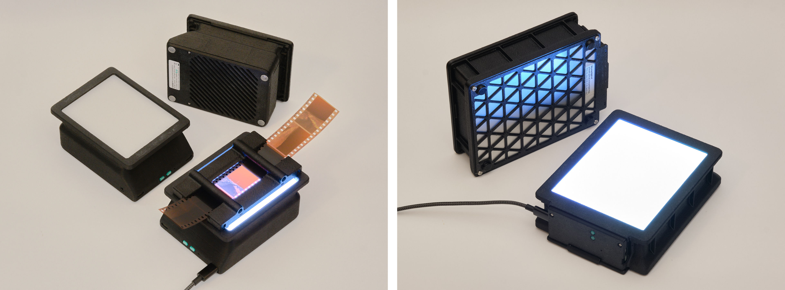

Left: [scanlight v4](./v4.md), right: [big scanlight](./big.md)

<small>Originally published 2024-08-05, last updated 2026-06-30 (added FAQ)</small>

## tl;dr

Narrowband trichromatic (RGB) light sources are superior to broadband (white) light for scanning color negative film; there are very good reasons why all commercial film scanners use RGB. ([film scanners were using blue LEDs at least a decade before they would be widely used in consumer products!](https://patents.google.com/?q=(film+scanner+LED)&oq=film+scanner+LED)) Scanning film with an RGB light source produces high quality results with minimal post-processing, without the need for specialized software.

### the results

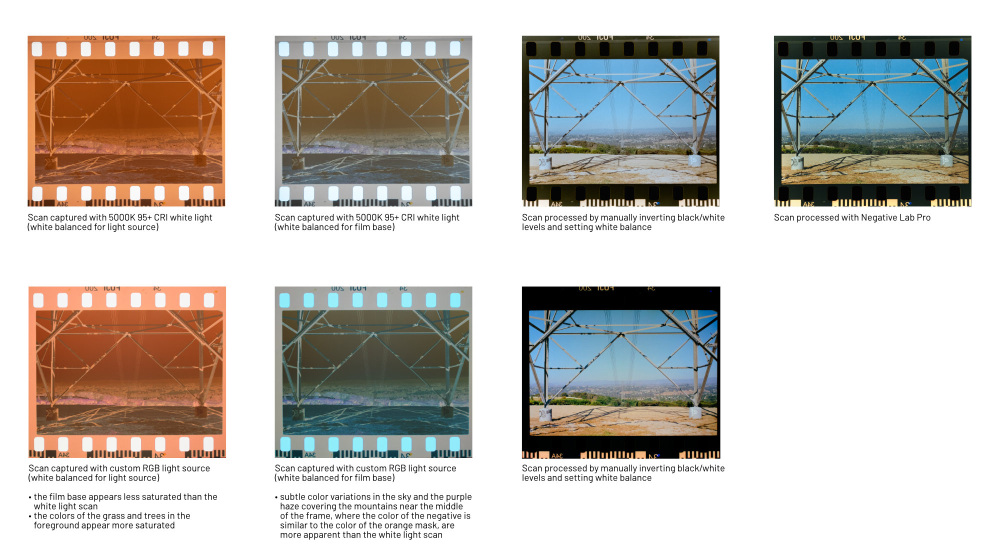

<small>Both scans captured using Fujifilm X-T30. White light scan captured using 95+ CRI 5000K light source. RGB scan captured using custom 450nm+525nm+665nm light source.</small>

## the simplified explanation

Color negative (C-41) film stores an image using cyan, magenta, and yellow dyes. Dyes appear a certain color because they absorb some wavelengths of light; for example, yellow dye mostly absorbs light in the 400-550nm range (which we perceive as violet through green), while allowing other wavelengths (yellow through red) to pass through the film. **These dyes are not intended to produce a human-viewable image, but rather to attenuate certain wavelengths of light for making prints on photosensitive paper.**

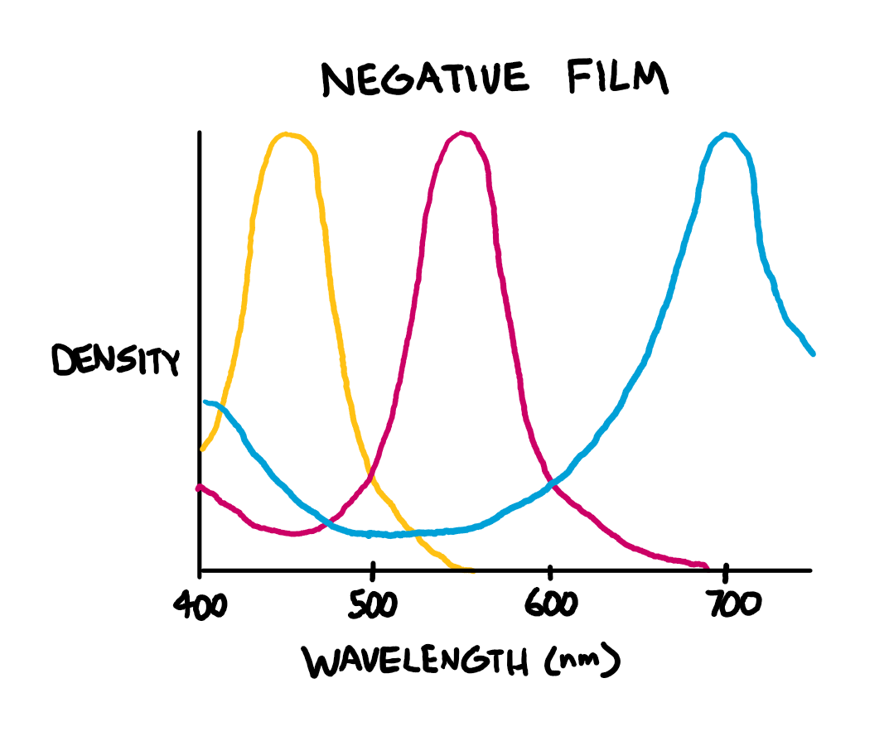

White light sources emit light over a broad spectrum of wavelengths. When white light passes through C-41 film, some of these wavelengths are only slightly absorbed by two or all three of the dyes, which means that these wavelengths aren't useful for recovering the information stored in the individual dye layers - for example, the 580-620nm band (yellow through red-orange light) is mostly transmitted through the film, with a small amount being absorbed by both the magenta and cyan dye layers.

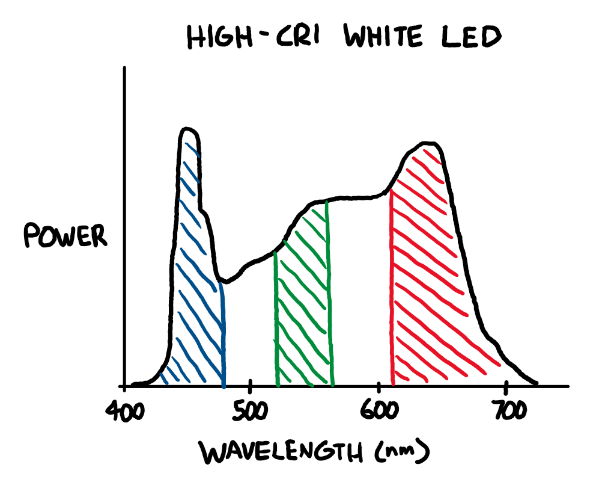

With darkroom printing, this is not an issue, as RA-4 color print paper (and motion picture print film) are, by design, most sensitive to specific bands of wavelengths that avoid these 'overlaps' between the dye layers in negative film.

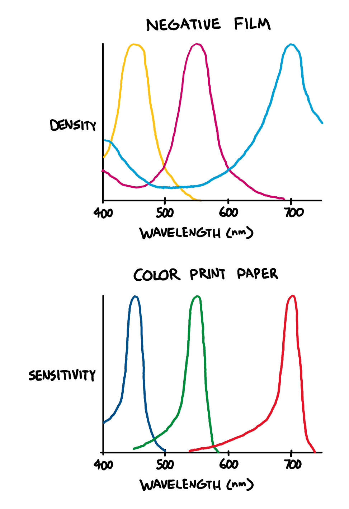

What about scanning film with a digital camera? Digital camera sensors are designed to capture light in a way that allows for a faithful reproduction of the colors that humans would perceive (this is a gross oversimplification.) C-41 film was *not* designed to be directly viewed by humans.

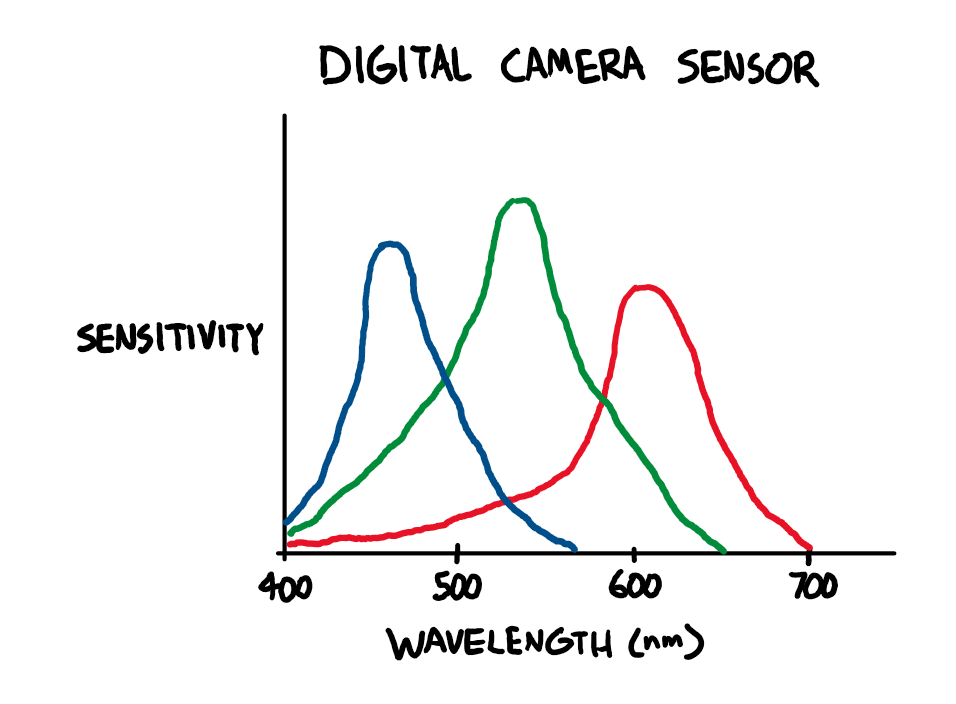

Not only is the camera sensitive to wavelengths of light that are effectively ignored by RA-4 paper, there is significant overlap between the color channel sensitivities of digital camera sensors: light in the ~580-600nm range is sensed by both the red and green channels, and light in the ~480-500nm range is sensed by both the green and blue channels.

Because the overall light transmission of C-41 film is heavy biased towards yellow and orange wavelengths due to the orange mask, this means that **a lot** of light gets through that interferes with both the red and green channels in the camera sensor. The red channel of the scan will contain not just information from the red-blocking cyan dye, but also the green-blocking magenta dye. The green channel will contain information from all three dye layers.

<small>note: the orange color of C-41 film is often misunderstood to be part of the film base, or an orange tint evenly applied over the whole image. It is actually a corrective mask made up of yellow and magenta positive images.</small>

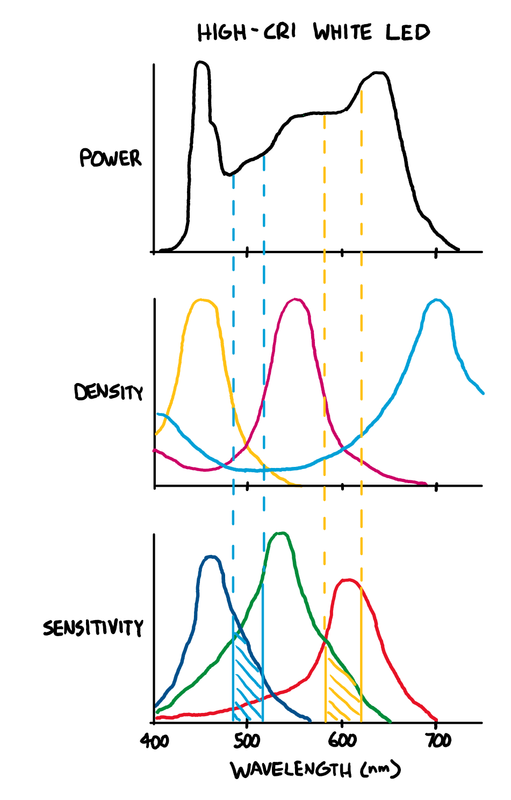

So if you scan color negative film with white light, you can't just invert the colors and expect a good result. You need to do some math to try to recover the individual dye layers of the film from ambiguous input data. This can't be done in standard image editing software, which is why dedicated software for negative conversion exists. This process will require extensive tuning for every combination of camera and light source used, and the color depth of the resulting positive image will be relatively low because **much of the information recorded by the camera is effectively useless yellow-orange light that has passed through the film without being significantly attenuated by any of the dyes**.

To avoid these issues, (almost?) all commercial negative film scanners use a trichromatic narrowband light source with red, green, and blue LEDs to minimize overlap between the dye layers in the film. When doing it this way, no software trickery is needed to recover an image and it's really as simple as inverting the color channels and setting the color balance and black/white points.

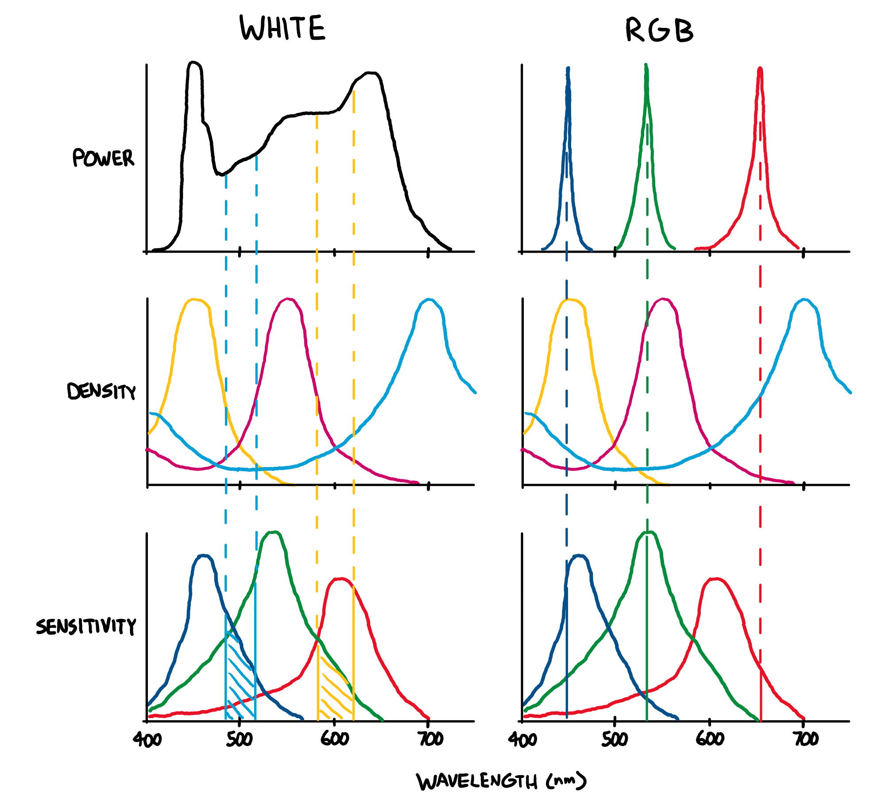

### so what LEDs should I use?

When considering the limitations of digital camera sensors, the ideal wavelengths are >650nm for red, 520-550nm for green, and <450nm for blue, as shown in the diagram above. However, to the best of my knowledge, there aren't any commercially available light sources combining LEDs of these wavelengths, so the only way (for now) to get an ideal light source is to build one yourself, which is discussed in the next section of this article.

The next best alternative is to use general purpose RGB LEDs, which typically use 620-630nm for red and 460-480nm for blue. The results will not be the absolute best possible, but will still be far better than with white light. The Fuji Frontier SP3000, a popular professional scanner, uses 630nm for red and 465nm for blue ([source](https://discuss.pixls.us/t/input-color-profile-to-use-for-negatives/20271/13)), but it does not have to contend with the color channel sensitivity of a typical digital camera - it has a monochrome image sensor and combines three exposures taken with red, green, and blue light.

If going this route, I would recommend placing an array of RGB LED strips or an off-the-shelf RGB video light panel behind a diffuser made from some combination of diffusing film and white or matte clear acrylic sheets to get the most even illumination possible.

### what about other light sources?

OLED displays do contain separate red, green, and blue emitters, but they typically have broader emission spectra than inorganic LEDs. They will produce results that are significantly better than a white light source, but not as good as RGB LEDs.

LCD displays emit white light that has been filtered through red, green, and blue filters and recombined. The results will depend on the emission spectrum of the exact display used and should be better than a white light source and worse than RGB LEDs. Newer high-gamut LCDs use special backlight LEDs designed to emit in narrower bands than typical white LEDs, so they should in theory work significantly better than older ones.

### scanning film with RGB

When scanning film with a narrowband light source, it's easy to get good results without using any specialized software. Using software designed for processing white light scans to process RGB scans may give suboptimal results.

#### my scanning and processing workflow
##### 1. scan
Scan all frames as RAW using fixed white balance and exposure. Exposure should be set such that none of the color channels are clipping.
##### 2. import
Import scans into image editing software. **Use a linear RAW profile.** Apply lens corrections if necessary. Use Lens Cast Calibration in Capture One or Flat-Field Correction in Lightroom to compensate for any unevenness in the light source.
##### 3. d-min balance
Neutralize the color of the minimum density (unexposed) areas of one negative, either by adjusting the white balance, adjusting the red, green, and blue channel max levels, or both.
##### 4. inversion
Invert the black and white points using the Levels or Curves tool and apply an appropriate curve to set the brightness of the output image.
##### 5. fine tuning
Apply these adjustments to all scans from the same roll of film. Manually fine-tune the black and white points, and if necessary, white balance or curves for all scans.

### more sample scans

Each group of four negatives were scanned and processed together in order to demonstrate how the light source affects the overall look of the scans rather than to show a subjectively ideal edit for each photo. Minimal post-processing was done to all scans (import image with linear raw profile, invert, color balance, apply tone curve). The same tone curve was used for all scans.

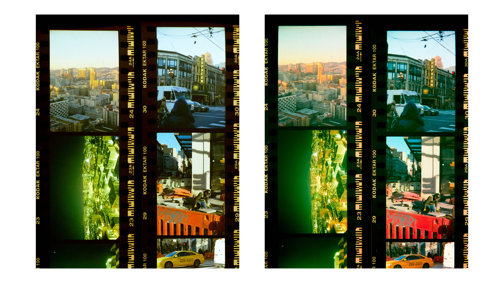

<small>Kodak Ektar 100 (left: white light, right: narrowband RGB light)</small>

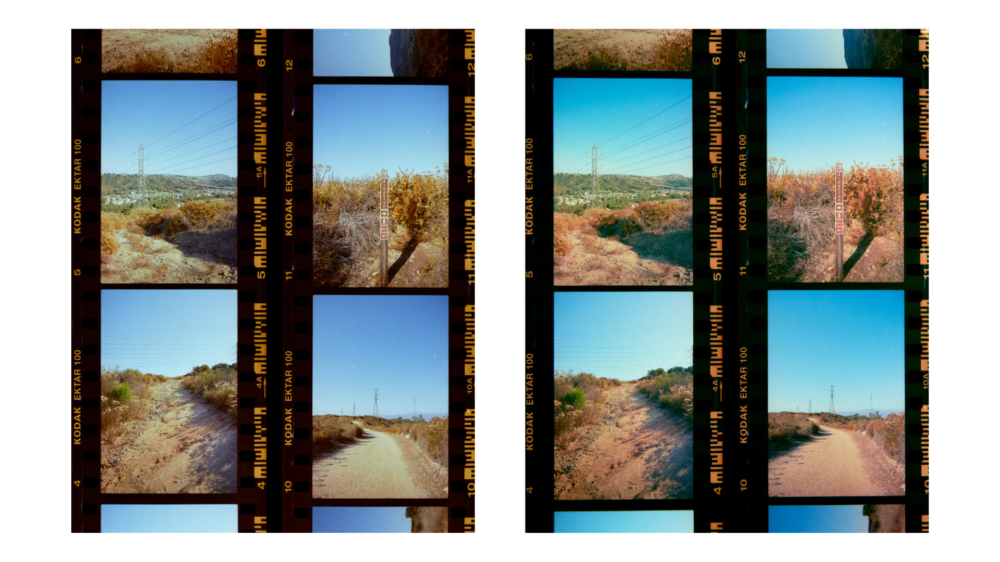

<small>Kodak Ektar 100 (left: white light, right: narrowband RGB light)</small>

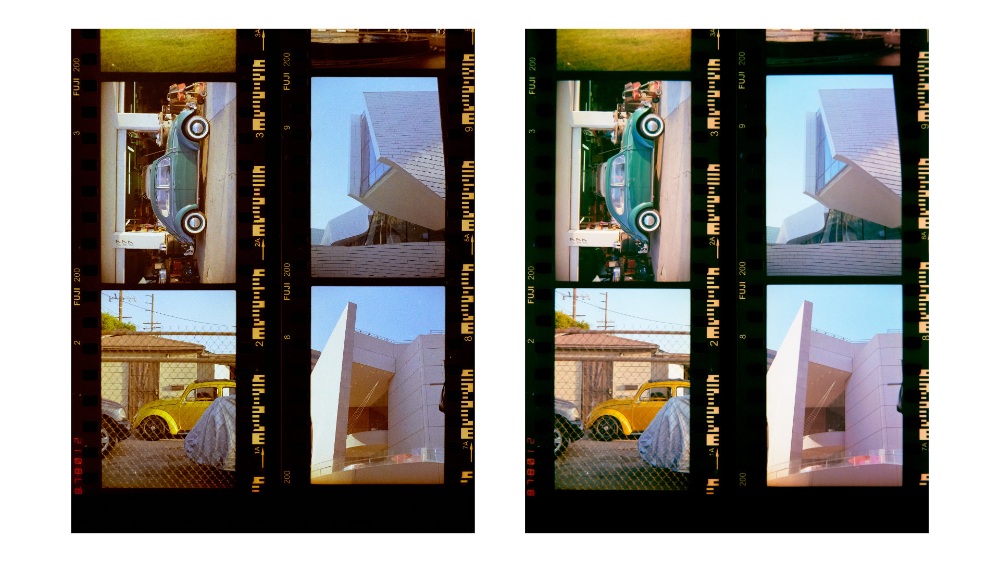

<small>Fuji 200 (left: white light, right: narrowband RGB light)</small>

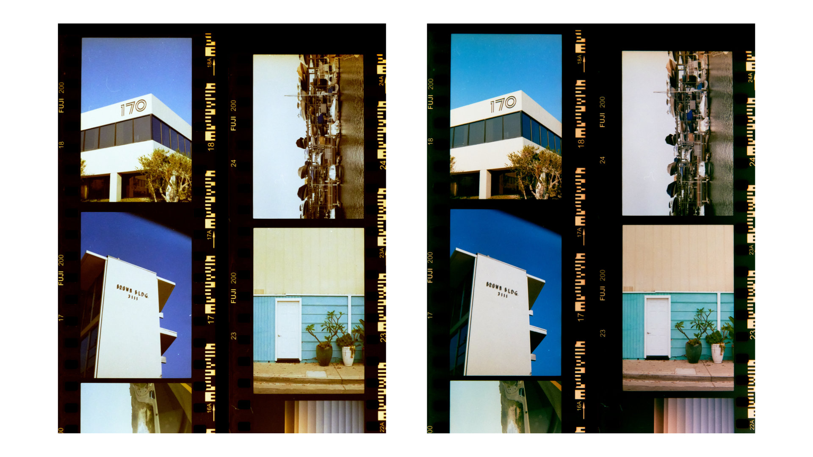

<small>Fuji 200 (left: white light, right: narrowband RGB light)</small>

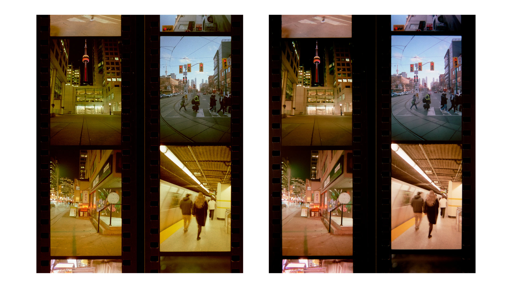

<small>Kodak Aerocolor IV 2460 (left: white light, right: narrowband RGB light)</small>

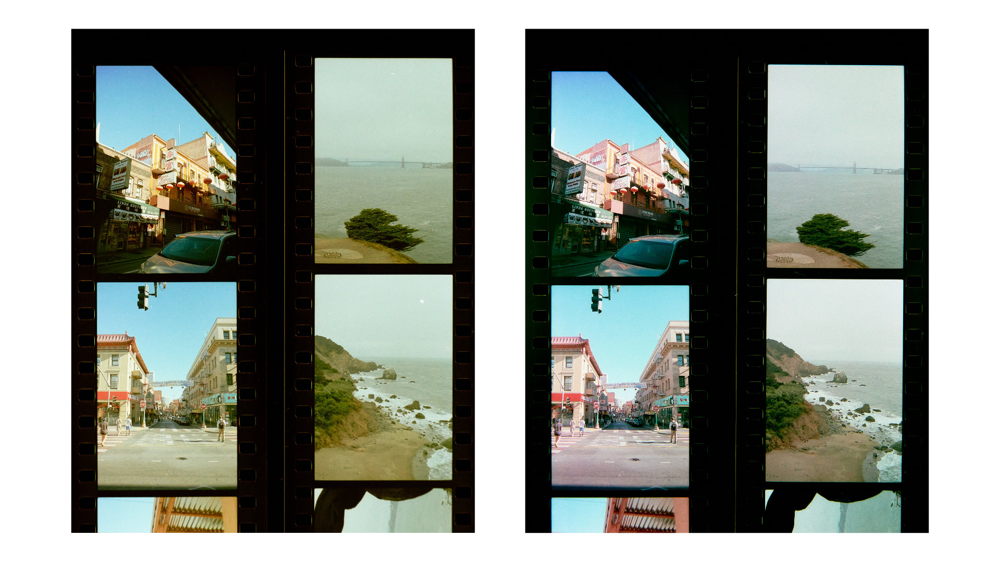

<small>Kodak Aerocolor IV 2460 (left: white light, right: narrowband RGB light)</small>

### recommended reading, if you're curious

* Edward J Giorgianni and Thomas E Madden, *Digital Color Management: Encoding Solutions, 2nd Edition*
* Robert L Shanebrook, *Making Kodak Film*

## part 2: the hardware

<small>Updated 2026-05-09</small>

To get the best possible results, I designed my own custom RGB light sources. More information on the designs can be found [here (scanlight v4)](./v4.md) and [here (big scanlight)](./big.md).

All design files for the light sources and film carriers, both current and older versions, can be downloaded from the [GitHub repository](https://github.com/jackw01/scanlight/).

## part 3: responses to frequent questions and comments

<small>Updated 2026-06-30</small>

#### but can't i just edit the white light scan to look like the RGB scan?
You can't get the exact same colors as the RGB scan by adjusting the white balance or individual color channels of a white light scan. This is physically impossible because the light interacted with the film in a fundamentally different way in the white light scan vs. the RGB scan before it was reduced to three bins of wavelengths approximately representing red, green, and blue by the camera sensor; some of the color information stored in the film is lost in this process.

#### but the colors in the sample scans still don't look good to me / the colors don't look the way i think film should look
Getting the desired colors from C-41 film, whether by darkroom printing or scanning and editing, has always involved some level of manual adjustment. It is also worth noting that our collective idea of how film is supposed to look is often influenced by highly edited or low-quality scans; old, faded prints; or even software emulations. **Photography is art, and as such it has always involved making subjective decisions about how images should look; all photos are interpretations of raw data and it's up to the photographer to decide what interpretation looks best.** The best starting point for editing is a scan that represents the image data stored in the dye layers of the film with maximum dynamic range and minimal crosstalk.

#### but the way you inverted the negatives isn't technically correct
I think it's safe to say that most photographers shooting film in 2024 are looking for *aesthetically pleasing* colors, not *technically perfect* colors. If you have a more technically accurate way to process your scans, then by all means use it (also, write an article about it or build open-source software to automate the process - **2026 update: [NegPy](https://github.com/marcinz606/NegPy) now exists!**). No matter how you post-process the scans, using a narrowband light source instead of a white light source will still get you closer to the results from a professional scanner.

#### won't this make all film look the same?
Scanning film with RGB light does not neutralize the differences in the "look" of different films; actually, it should produce results that are closer to the intended look of the film when printed on RA-4 paper. The differences in look come from differences in the film's sensitivity to light during exposure and chemical reactions that affect how the dyes are formed during development, not the absorption characteristics of the dyes themselves.

#### should i capture three separate exposures for each color channel?
You can either capture a single image with the red, green, and blue channels on at the same time or capture separate images for each color and merge them later. Both methods can produce satisfactory results. The latter approach has the potential for more technically accurate colors as it eliminates any chance of crosstalk between color channels, but takes significantly more work than capturing a single RGB image which can be processed directly.

When capturing red, green, and blue at the same time, the severity of crosstalk depends heavily on the spectral response of the camera's image sensor and camera manufacturer's color profile, and it may not even be noticeable in many cases. Crosstalk typically manifests as consistent color shifts (usually, reds appearing too pink or greens appearing too yellow,) and can usually be resolved by post-processing with software that supports a crosstalk matrix or RGB primary calibration, such as NegPy (open-source) or Lightroom.

#### how should i adjust the red/green/blue channel levels on the light source?
The red, green, and blue channels on the light source should be adjusted to maximize how much of the camera's dynamic range is utilized on all three color channels. To do this, set the camera white balance to neutral/5000K and adjust the light source so that the histogram peaks on each channel become aligned when the camera is viewing the light through an unexposed, developed piece of film. The deep red (~650nm) and deep blue (~450nm) wavelengths used for RGB scanning are near the edge of what most Bayer-filter image sensors are sensitive to, so some cameras will be significantly more sensitive to one of these wavelengths than others. Therefore, the optimal settings will differ between camera manufacturers and models.

#### should i use narrowband light for scanning color positive (slide) film?
Some people have had success using an adjustable RGB light source for recovering faded slides, but I would not recommend using a narrowband light source for scanning slides that are in good condition. The results I have seen so far are not promising compared to using white light, as colors are typically oversaturated and pink, red, and orange hues become indistinguishable from each other. This likely all comes down to the fact that color positive film is designed to reproduce colors naturally when viewed with a broad-spectrum light source. Any high CRI (95+) white light source should work well. There is some debate over the ideal color temperature: the majority of slide projectors used halogen bulbs with a 3000K-3500K color temperature, but some will argue that a 5000K color temperature should be used instead (this seems to be because Fujifilm datasheets recommend viewing with a ISO 3664 compliant viewer, which historically would have used specialized 5000K high-CRI fluorescent tubes as a light source). I haven't seen a side-by-side comparison, but I would assume that the difference in results would be very subtle or nonexistent if the white balance is corrected when editing the scans.

#### does light source / color matter for scanning black and white film?
No. White and narrowband light sources work equally well for scanning B&W film.

#### what lens should i use?
[This list](https://www.pixl-latr.com/how-good-a-macro-lens-do-you-really-need-for-dslr-mirrorless-camera-scanning/) is generally a good starting point. The Micro-Nikkor 55mm f/2.8 AI and Canon FD 50mm f/3.5 Macro are my personal favorites as they are affordable and widely available.

I would **not** recommend low-cost third-party macro lenses like the TTArtisan 40mm f/2.8 Macro or 7artisans 60mm f/2.8 Macro II. While the build quality of these lenses is excellent and they generally have superior contrast to vintage lenses due to better optical coatings, in my experience they cannot match the top tiers of lenses in the above list in corner-to-corner sharpness and lack of chromatic aberration. I would also recommend against using extension tubes with modern non-macro lenses; this tends to result in field curvature and other aberrations which can be quite severe depending on the lens.

#### does brightness enhancing film actually work? should i use it?
Brightness enhancing film (BEF) does indeed work to make diffuse light sources more directional, but this can cause other issues. Collimated light makes the image on the film appear slightly sharper, but also exaggerates the appearance of dust and scratches. Depending on the relative positioning of the light source, film, and lens; and type of lens used; grid or moiré patterns may appear due to the structure of the brightness enhancing film and vignetting may occur or become more pronounced. BEF also tends to be difficult to keep clean of dust and fingerprints.

#### 540-550nm appears to be the ideal green wavelength, why use 525nm?
LEDs in the 540-560nm range are impractical for most uses due to poor efficiency and thus are not widely available. Some GaP green LEDs exist which have peak emission at 555nm, but they are extremely inefficient, requiring hundreds to match the light output of a single 2835 mid-power InGaN LED. Some manufacturers do offer 530-535nm wavelength bins of their InGaN mid-power green LEDs, but these are difficult to source as they are commercially undesirable due to lower efficiency. Applications where a "true green" or "lime green" color is desired usually now use phosphor-converted LEDs, which are very efficient but are suboptimal for film scanning as they output light over a much broader band of wavelengths (60-100nm FWHM vs 15-30nm for direct green LEDs.)

##### how did old film scanners get ~540nm?
They either used cold-cathode fluorescent lamps with phosphors tuned to emit at the desired wavelengths, or used InGaN green LEDs from a higher wavelength bin. These have become increasingly hard to find as manufacturing processes have become more consistent and the industry has settled on ~525nm as the standard green wavelength for lighting and display applications. On the other hand, mid- and high-power ~450nm deep blue and ~660nm deep red LEDs have stayed available alongside their more common ~470nm and ~620nm counterparts due to increased demand, mostly in horticultural applications.

#### why does big scanlight have infrared LEDs?
The IR LEDs are for dust removal – the dyes in color negative film transmit infrared light, but dust does not. By capturing a separate IR image with an IR-sensitive camera, dust particles on the image can be easily located and inpainted. I originally added the LEDs for a specific customer who uses a specialized industrial camera and custom software processing pipeline to do this. As of June 2026, the only free/open-source software I know of that can automate this process is [NegPy](https://github.com/marcinz606/NegPy), although I haven't yet tested it with output from big scanlight.

#### will there be a desktop app for scanlight?
There are no plans for a desktop app right now, since the easiest way to make one by far is to just repackage a web app as a desktop app and there is little to be gained by doing this. It is possible to install the app as a progressive web app on most platforms, which will make it appear as a desktop app and allow it to be used without an internet connection.

## license

The PCB schematic, layout, and Gerber files and the 3D CAD files for this project are released under the [CERN Open Hardware Licence Version 2 - Weakly Reciprocal](https://choosealicense.com/licenses/cern-ohl-w-2.0/) (CERN-OHL-W V2). Software and firmware are released under the MIT License. The text and illustrations in this article may not be reproduced without permission.
