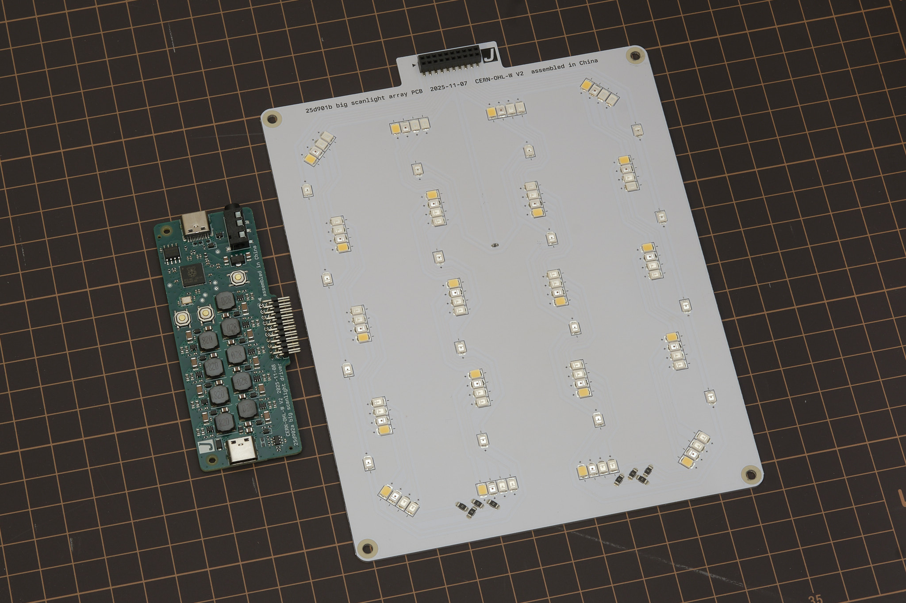
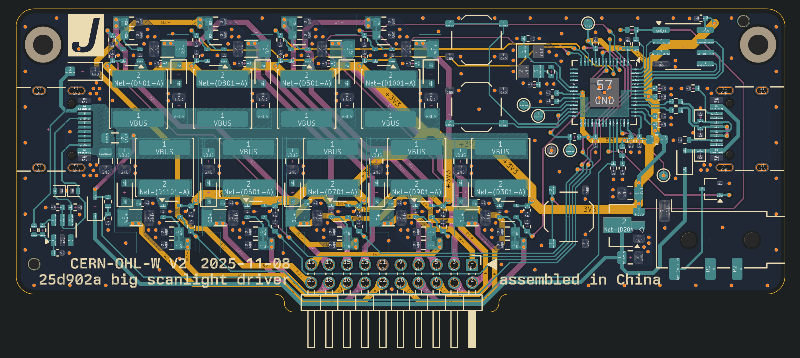

# big scanlight info & instructions

## features
* Illuminated area dimensions: 108x134mm (approx. 4.25x5.25in)
* Suitable for use with 35mm, medium format, and 4x5 film
* 20 each of deep red (665nm), green (525nm), deep blue (455nm), and 5000K 95CRI white, and 16 infrared (850nm) LEDs mounted on aluminum PCB for optimal heat dissipation
* Up to 15EV brightness1 in RGB combined mode, 14EV in white mode
* Better light uniformity over medium format frame sizes than scanlight v2/v3
* Diffuser made from fingerprint- and scratch-resistant textured acrylic
* 3D printed ABS housing
* Fully controllable via USB with [web app](https://jackw01.github.io/scanlight/automation/app_bsl/dist/index.html)
* On/off and mode toggle buttons on light source for standalone usage
* Compatible with accessories made for Negative Supply 4x5" light sources2
* Adapter available for compatibility with [ToneCarrier](#tonecarrier-adapter)
* Simple 35mm and medium format film carriers available
* Automated camera shutter control for capturing separate red/green/blue images
* Powered using any USB-C power source (at least 9V at 18W required for full brightness)
* Open source hardware and software

<small>
11/500s at f/8, ISO 100. Direct measurement of the light source (without film.) 
2big scanlight's diffuser panel is inside a 108x134mm, 1.5mm deep recess in the diffuser bezel, designed to accept masks and film carriers for Negative Supply 4x5" light sources. Check dimensions of accessories you plan to use before buying.
</small>  

Original article on scanning film with narrowband light (with sample scans): *[A Better Light Source For Scanning Color Negative Film](./README.md)*.

## instructions

### basic operation

The light source is powered via the **left USB-C port**. A USB-C PD power source that can supply at least 2A at 9V (e.g. most USB-C phone, tablet, and laptop chargers) is required to operate at full brightness; however, the light will still operate at reduced brightness from any USB power source capable of delivering at least 2A at 5V (e.g. almost all USB chargers from the last 10 years.)

*It is not recommended to power the light from a USB port on a computer; a dedicated USB power supply should be used instead.*

Press the **upper button** to toggle the light on and off. Press the **lower button** to toggle between narrowband RGB and 95CRI white modes. The buttons work even when the light is not connected to a computer. The default RGB channel brightnesses in this mode can be configured from the GUI, as explained below.

To adjust color and brightness and automate the process of scanning red, green, and blue channels separately, the light source can be connected to a computer via the **right USB-C port** and controlled with the web app located [here](https://jackw01.github.io/scanlight/automation/app_bsl/dist/index.html). The web app requires a Chromium-based web browser.

In the **Manual Control** panel of the web app, the red, green, and blue channel brightnesses can be adjusted and the color channels can be turned on individually or together. In **RGB** (narrowband trichromatic) mode, the red, green, and blue LEDs are on at the same time. In **White** mode, only the 95CRI white LEDs are on. The red, green, blue, and infrared LEDs can also be turned on individually; the RGB channel brightness adjustments still apply in this case.

The **RGB Presets** panel of the web app allows RGB channel brightness settings to be stored to and loaded from web browser local storage, using the **Load**, **Create**, **Rename**, and **Delete** buttons.

The **Set as Default** and **Load Default** buttons refer to the default RGB preset, which is stored onboard the light source. This functionality is separate from presets stored in the web app and sets the RGB channel brightnesses used when the light is first powered on and when it is not connected to a computer.

### remote shutter release usage

The **3.5mm jack** can be connected to a camera so that the shutter can be remotely triggered from the web app to automatically capture images for each color channel. The length of the shutter trigger pulse and the delay after are both configurable. The default settings should work for most use cases. Operation in the **R,G,B** mode is shown in the timing diagram below; the other modes work similarly.

A cable with a male 3.5mm plug (otherwise known as a headphone connector) on one end and a camera-specific connector on the other end is required to use this functionality. A wide variety of these cables are available from online retailers; I cannot vouch for the quality of any of them or verify that a specific cable will work, as wiring diagrams are almost never published by the manufacturers. The design has been tested and works with several Fujifilm and Canon cameras that use the 2.5mm microphone jack as the remote shutter release input, with a 3.5mm to 2.5mm cable as well as a standard 3.5mm audio cable and 3.5mm to 2.5mm adapter.

Because the 3.5mm jack is not electrically isolated from the USB ports, it is recommended out of an abundance of caution that the camera should not be connected to the same USB power supply or computer as the light source when using the remote shutter control function. For most cameras, doing so will not cause any issues, but because there is no formal standard for how remote shutter cables or connectors are wired, some cameras may exist that could be damaged by such a setup.

### firmware updates

The web app will automatically notify if a firmware update is available and show a button to put the device into firmware update mode. To manually enter firmware update mode, press and hold down the **DFU mode button** while connecting the **right USB-C port** to a computer. The light source will show up as a USB storage device, and a firmware binary file can be copied to this device to update the firmware.

### cleaning precautions

Cleaning the acrylic diffuser panel with cleaning solutions containing high concentrations of isopropanol, other organic solvents, or ammonia can cause crazing or cracking of the acrylic. If needed, use a cleaner meant for eyeglasses or a diluted household all-purpose cleaner like Simple Green. Do not spray liquids directly on the light source.

### brightness trimming

In order to simplify the electrical design of the light source, the red, green, blue, and white color channels are split into two independently driven sides as shown below. The components used are very well matched, so the difference in brightness between the two sides should be a few percent at most and will generally not be noticed unless working with very low-contrast negatives. If there is a noticeable and consistent "split" in brightness or color across the centerline of the light source, the relative brightness of the two halves can be fine-tuned in the **Brightness Trimming** menu in the web app. Setting the trim values to a positive number increases the relative brightness of side 2; setting them to a negative number increases the relative brightness of side 1.

## technical details

### dimensions

### film carrier compatibility

Adapters are available for improved usability with [toneCarrier](https://tonephotographic.com/) and Valoi 360 Advancer [coming soon] film carriers. Drawings of the adapters with critical dimensions are included below for reference; the dimensions of these third-party film carriers are not published by the manufacturers and are subject to change, so please use these drawings to verify compatibility with your film carriers before buying.

#### toneCarrier 35mm/120 adapter

<small>All dimensions in millimeters.</small>

### optical design

Big scanlight uses a very simple optical design consisting of a matte white acrylic diffuser panel, an LED array which spans the entire illuminated area of the diffuser, and a housing with diffusely reflective sidewalls perpenicular to the PCB and chamfered corners to reduce brightness falloff. In RGB mode, big scanlight achieves superior lighting uniformity to scanlight v2/v3 over a larger area. In white light mode, lighting uniformity is similar to scanlight v2/v3 over a larger area.

### PCBs

The driver PCB integrates a RP2040 32-bit ARM Cortex-M0+ microcontroller, nine [TPS61169](https://www.ti.com/lit/ds/symlink/tps61169.pdf?ts=1764654827638&ref_url=https%253A%252F%252Fwww.google.com%252F) constant-current boost converters configured for 80mA output current at up to 38V, and a [CH221K](https://www.wch.cn/products/CH224.html) USB-PD protocol controller on a 86x34mm four-layer PCB.

All design files for the [driver pcb](https://github.com/jackw01/scanlight/tree/main/bsl_driver_pcb_r1) and [LED PCB](https://github.com/jackw01/scanlight/tree/main/bsl_array_pcb_r1) can be downloaded from the GitHub repository.

[Driver PCB Schematic as PDF](bsl_driver_pcb_r1/bsl_drv_v1_20251109.pdf)

[Driver PCB BOM](bsl_driver_pcb_r1/bsl_drv_v1_20251109.csv)

[LED PCB Schematic as PDF](bsl_array_pcb_r1/bsl_array_v1_20251109.pdf)

[LED PCB BOM](bsl_array_pcb_r1/bsl_array_v1_20251109.csv)

### mechanical design

STEP files for all parts of the light source, film carrier adapters, and film carriers can be downloaded from the [GitHub repository](https://github.com/jackw01/scanlight/tree/main/3d).

### firmware and web app

The [source code for the Pi Pico firmware](https://github.com/jackw01/scanlight/tree/main/automation/firmware_bsl1), a [ready-to-flash firmware binary](https://github.com/jackw01/scanlight/blob/main/automation/bsl1_controller_v1.0.uf2), and the [source code for the remote control web app](https://github.com/jackw01/scanlight/tree/main/automation/app_bsl) can be downloaded from the GitHub repository. The firmware is implemented using the RP2040 SDK and the web app is made with [Vue](https://github.com/vuejs) and [Vuetify](https://github.com/vuetifyjs/vuetify).

### license

The PCB schematic, layout, and Gerber files and the 3D CAD files for this project are released under the [CERN Open Hardware Licence Version 2 - Weakly Reciprocal](https://choosealicense.com/licenses/cern-ohl-w-2.0/) (CERN-OHL-W V2). Software and firmware are released under the MIT License.
