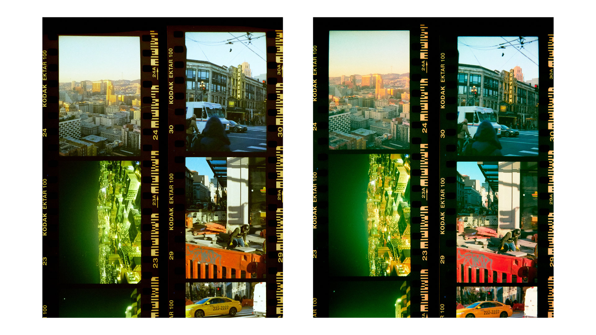
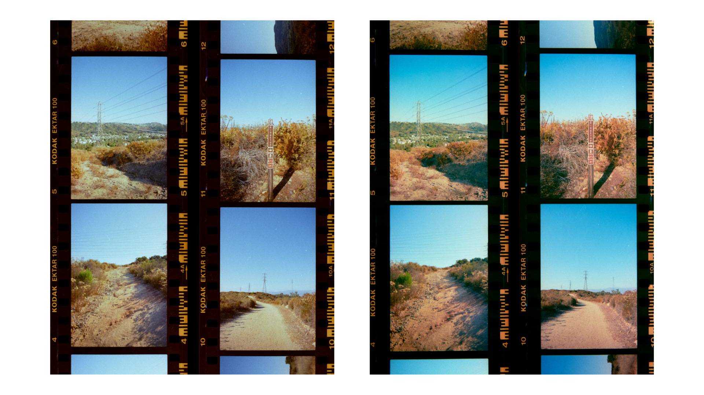
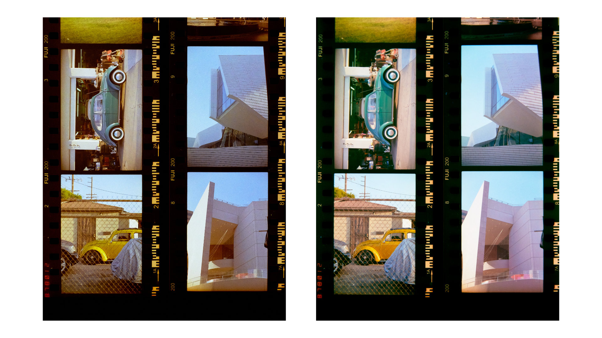
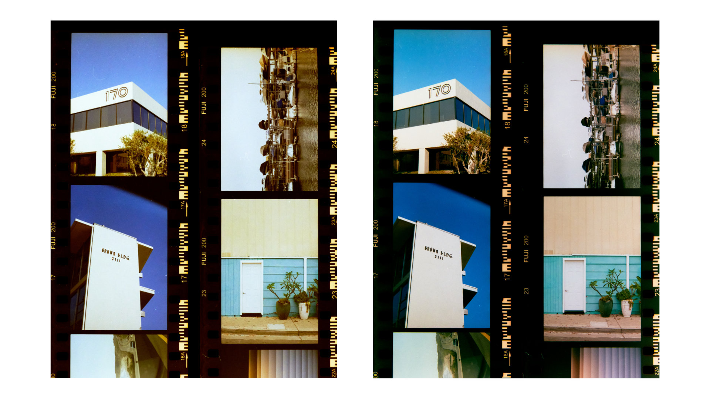
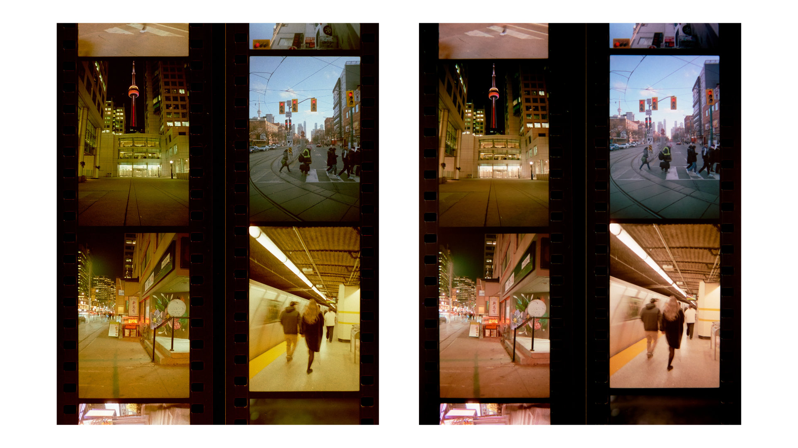
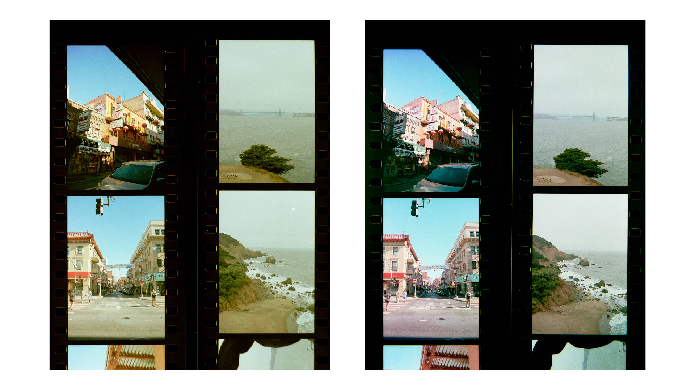

# scanlight 2

### features
* Illuminated area dimensions: 100x74mm
* Suitable for use with 35mm and medium format film (sample scans available)
* Six each of deep red (660nm), green (520nm), and deep blue (450nm) 2835 package LEDs
* Front diffuser made from ACRYLITE® Satinice fingerprint- and scratch-resistant light diffusing acrylic
* 3D printed ABS housing with high reflectivity interior achieved using aluminum pigment paint
* Designed for vertical use with a copy stand or horizontal use with optional threaded insert mounting points
* Magnetically-attached 35mm and medium format film carriers available
* Powered using either a 19-24V barrel jack AC adapter or a 20V-capable USB PD supply
* Open source design released under the CERN OHL-W-V2 license

I will be building a limited quantity of scanlight 2 units for sale - for more details, see [my shop on Ko-Fi](https://ko-fi.com/jackw01/shop). Estimated shipping date: Early August 2025.

Low-cost upgrade kits will be available to v1 buyers: request one [here](https://ko-fi.com/s/b195e963f8).

## optical design

In terms of light uniformity, the new diffuser design is significantly better than version 1 and is generally on par with other uniform light sources. Scanlight 2 performs nearly as well when evaluated for 6x8 medium format film as scanlight 1 does when evaluated for 135 film:

<small>Comparison: scanlight 1 vs scanlight 2 vs competing white LED light panel vs LCD monitor. All images show a 100x72mm physical area at the center of each light source. A thin plastic diffuser was placed over the LCD display to avoid moiré effect.</small>

<small>Comparison: white LED light panel (left) vs scanlight 2 (right)</small>

Both of these scans have been inverted and color balanced *without* any calibration for light source luminance or color uniformity. Negatives are 6x6 medium format Kodak Ektar 100.

All this is achieved using a simpler optical design inspired by professional film scanner light sources, using a reflective housing and single high-quality acrylic diffuser to improve both color mixing and luminance uniformity over version 1.

**Note: Using Lens Cast Calibration in Capture One or Flat-Field Correction in Lightroom is still highly recommended no matter which light source you use.**

## film carriers

The 35mm and medium format film carriers use a double S-curve design to keep the film flat and have a small film-to-light distance (35mm: 2.8mm, medium format: 3.8mm) to minimize vignetting. Both film carriers feature interchangeable masks that snap into the back of the carrier to block stray light from reaching the camera. The double S-curve design is optimized for scanning full rolls or cut pieces >150mm in length; scanning shorter pieces may be difficult especially if the film is curled across its width.

Design files are available [here](https://github.com/jackw01/scanlight/3d/film_carriers).

## horizontal mounting

As an alternative to using a tripod or vertical copy stand, 3D printable parts for mounting the light source and a camera with an Arca-Swiss quick-release plate to a piece of 20x20mm T-slot aluminum extrusion are included. This mounting method will accommodate cameras where the distance between the center of the lens and the bottom plane of the quick-release plate is at least x mm - the included 3D printable spacers can be used to offset the height of the light source to accommodate larger cameras.

Design files are available [here](https://github.com/jackw01/scanlight/3d/horizontal).

Hardware required for assembly:
* 4x M3 socket head cap screws, length between 16mm and 30mm depending on spacers used
* 4x M3x5x4 heat-set threaded inserts
* 6x M5x8 socket head or button head cap screws
* 6x M5 t-slot nut for 2020 aluminum extrusion

## sample scans

Each group of four negatives were scanned and processed together in order to demonstrate how the light source affects the overall look of the scans rather than to show a subjectively ideal edit for each photo. Minimal post-processing was done to all scans (import image with linear raw profile, invert, color balance, apply tone curve). The same tone curve was used for all scans.

<small>Kodak Ektar 100 (left: white light, right: narrowband RGB light)</small>

<small>Kodak Ektar 100 (left: white light, right: narrowband RGB light)</small>

<small>Fuji 200 (left: white light, right: narrowband RGB light)</small>

<small>Fuji 200 (left: white light, right: narrowband RGB light)</small>

<small>Kodak Aerocolor IV 2460 (left: white light, right: narrowband RGB light)</small>

<small>Kodak Aerocolor IV 2460 (left: white light, right: narrowband RGB light)</small>

### note on brightness enhancing film

When installed below the main diffuser and a significant distance away from the LEDs, brightness enhancing film appears to create hotspots in the spaces in the center of each group of 4 LED clusters. When installed above the main diffuser, it introduces vignetting around the center of the image. Brightness enhancing film also scratches easily and is difficult to keep free of dust and oils. Because of this, the v2 diffuser does not use brightness enhancing film internally. Separate sheets of BEF (3M BEF3-T-155n; equivalent to Cinestill CS-LiteBrite+) will be available as a low-cost addon for anyone who wants to experiment with it.

## PCB details

The version 2 PCB maintains the same functionality as version 1 and adds a header to allow external on/off control of each color channel, in case someone wants to automate the process of capturing individual channel scans using a monochrome camera. The through-hole brightness adjustment potentiometers have been changed to SMD trimmer potentiometers since v1 testing showed that it is generally not necessary to adjust individual channel brightnesses to get good results.

All design files can be downloaded from the [GitHub repository](https://github.com/jackw01/scanlight/pcb_v2).

[PCB Schematic as PDF (Rev. 2)](pcb_r2/scanlight_schematic_r2_20250328.pdf)

[PCB BOM](pcb_r2/scanlight_bom_r2_20250328.csv)

[LED datasheet](https://downloads.cree-led.com/files/ds/j/JSeries-2835-Color.pdf)
