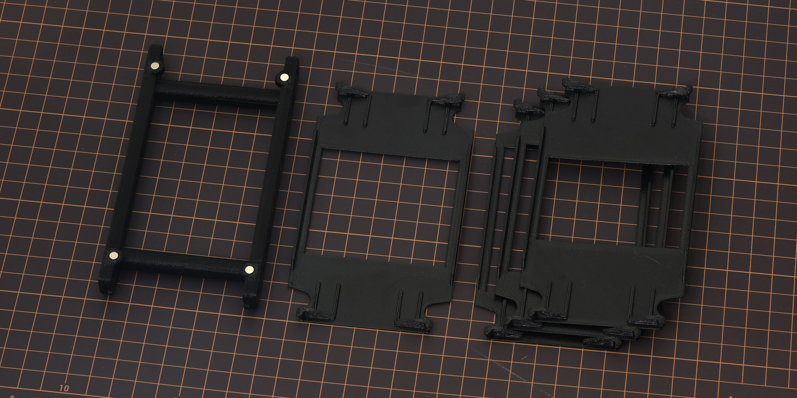

# scanlight v3 info

<small>HW v2 shown, v3 similar.</small>

## features
* Illuminated area dimensions: 100x74mm
* Suitable for use with 35mm and medium format film
* Six each of deep red (665nm), green (525nm), and deep blue (455nm) LEDs
* Front diffuser made from fingerprint- and scratch-resistant textured acrylic
* 3D printed ABS housing with high reflectivity interior achieved using aluminum pigment paint
* Capable of per-channel brightness control, and **tethered remote control from a computer** (new in v3)
* Designed for vertical use with a copy stand or horizontal use with optional threaded insert mounting points
* Magnetically-attached 35mm and medium format film carriers available
* Powered using either a 19-24V barrel jack AC adapter or a 20V-capable USB PD supply
* Open source hardware and software

Original article on scanning film with narrowband light (with sample scans): *[A Better Light Source For Scanning Color Negative Film](./README.md)*.

I will be building a limited quantity of scanlight units for sale - for more details, see [my shop on Ko-Fi](https://ko-fi.com/jackw01/shop).

Low-cost upgrade kits are available to v1 buyers: request one [here](https://ko-fi.com/s/b195e963f8).

## technical info

### optical design

In terms of light uniformity, the new diffuser design is significantly better than version 1 and is generally on par with other uniform light sources. Scanlight 2 and 3 perform nearly as well when evaluated for 6x8 medium format film as scanlight 1 does when evaluated for 135 film:

<small>Comparison: scanlight 1 vs scanlight 2 vs competing white LED light panel vs LCD monitor. All images show a 100x72mm physical area at the center of each light source. A thin plastic diffuser was placed over the LCD display to avoid moiré effect.</small>

<small>Comparison: white LED light panel (left) vs scanlight 2 (right)</small>

Both of these scans have been inverted and color balanced *without* any calibration for light source luminance or color uniformity. Negatives are 6x6 medium format Kodak Ektar 100.

All this is achieved using a simpler optical design inspired by professional film scanner light sources, using a reflective housing and single high-quality acrylic diffuser to improve both color mixing and luminance uniformity over version 1. The diffuser is made from ACRYLITE® Satinice light-diffusing acrylic, which has a finely textured surface that hides fingerprints and scratches and is easy to keep clean.

**Note: Using Lens Cast Calibration in Capture One or Flat-Field Correction in Lightroom is still highly recommended no matter which light source you use.**

### film carriers

The 35mm and medium format film carriers use a double S-curve design to keep the film flat and have a small film-to-light distance (35mm: 2.8mm, medium format: 3.8mm) to minimize vignetting. Both film carriers feature interchangeable masks that snap into the back of the carrier to block stray light from reaching the camera, and the 35mm carrier has a snap-on hood to prevent external light from reflecting off the film. Medium format masks are available in all common sizes, and the film carrier exposes enough area to scan 6x9 negatives when no mask is installed. The double S-curve design is optimized for scanning full rolls or cut pieces >150mm in length; scanning shorter pieces may be difficult especially if the film is curled across its width.

### horizontal mounting

<small>HW v2 shown, v3 similar.</small>

As an alternative to using a tripod or vertical copy stand, 3D printable parts for mounting the light source and a camera with an Arca-Swiss quick-release plate to a piece of 20x20mm T-slot aluminum extrusion are included. This mounting method will accommodate cameras where the distance between the center of the lens and the bottom plane of the quick-release plate is at least 36 mm - the included 3D printable spacers can be used to offset the height of the light source to accommodate larger cameras.

Design files are available [here](https://github.com/jackw01/scanlight/tree/main/3d/horizontal).

### note on brightness enhancing film

When installed below the main diffuser and a significant distance away from the LEDs, brightness enhancing film appears to create hotspots in the spaces in the center of each group of 4 LED clusters. When installed above the main diffuser, it introduces vignetting around the center of the image. Brightness enhancing film also scratches easily and is difficult to keep free of dust and oils. Because of this, the v2 diffuser does not use brightness enhancing film internally. Separate sheets of BEF (3M BEF3-T-155n; equivalent to Cinestill CS-LiteBrite+) will be available as a low-cost addon for anyone who wants to experiment with it.

### PCB details

The version 3 PCB is an incremental improvement over version 2 and allows a Raspberry Pi Pico microcontroller to be attached directly to the main board, which enables full control of the light from a computer using the web app here: https://jackw01.github.io/scanlight/automation/app/dist/index.html. This functionality can also be enabled on v2 by connecting an external Raspberry Pi Pico to the header on the PCB.

All design files can be downloaded from the [GitHub repository](https://github.com/jackw01/scanlight/tree/main/pcb_r3).

[PCB Schematic as PDF (Rev. 3)](pcb_r3/scanlight_schematic_r3_20251023.pdf)

[PCB BOM](pcb_r3/scanlight_bom_r3_20251023.csv)

[LED datasheet](https://downloads.cree-led.com/files/ds/j/JSeries-2835-Color.pdf)

### mechanical design

STEP files for all parts of the light source and film carriers can be downloaded from the [GitHub repository](https://github.com/jackw01/scanlight/tree/main/3d).

### firmware and web app

The web app for controlling scanlight v3 is available [here](https://jackw01.github.io/scanlight/automation/app/dist/index.html). A Chromium-based web browser is required as other browser engines do not support the WebUSB/WebSerial API.

The [source code for the Pi Pico firmware](https://github.com/jackw01/scanlight/tree/main/automation/firmware_sl2), a [ready-to-flash firmware binary](https://github.com/jackw01/scanlight/blob/main/automation/sl2_controller_v1.3.uf2), and the [source code for the remote control web app](https://github.com/jackw01/scanlight/tree/main/automation/app_sl2) can be downloaded from the GitHub repository. The firmware is implemented using the RP2040 SDK and the web app is made with [Vue](https://github.com/vuejs) and [Vuetify](https://github.com/vuetifyjs/vuetify).

### license

The PCB schematic, layout, and Gerber files and the 3D CAD files for this project are released under the [CERN Open Hardware Licence Version 2 - Weakly Reciprocal](https://choosealicense.com/licenses/cern-ohl-w-2.0/) (CERN-OHL-W V2). Software and firmware are released under the MIT License.
