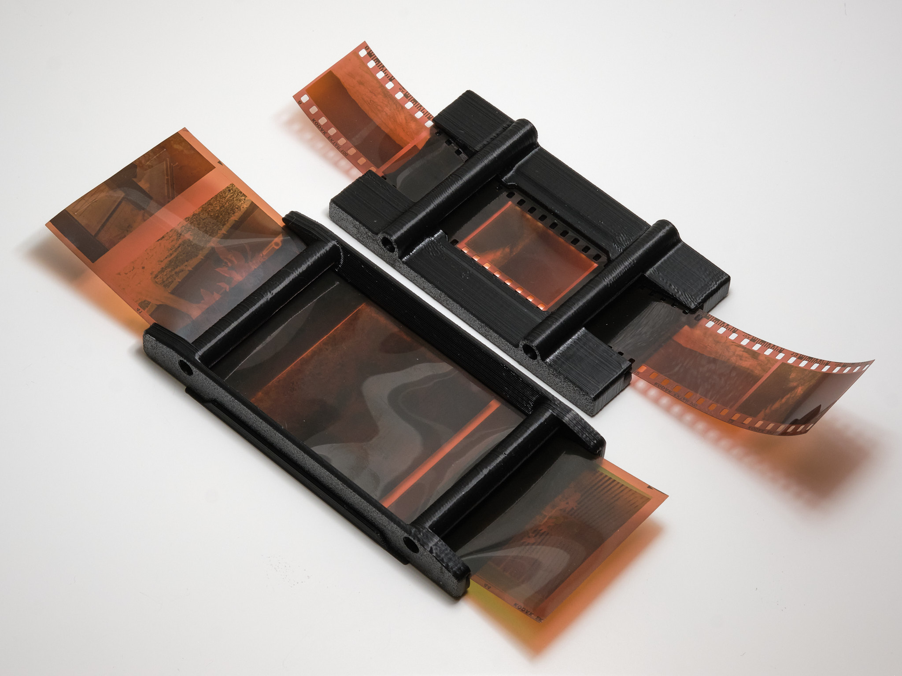
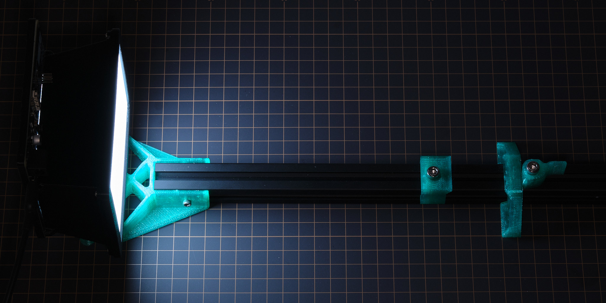
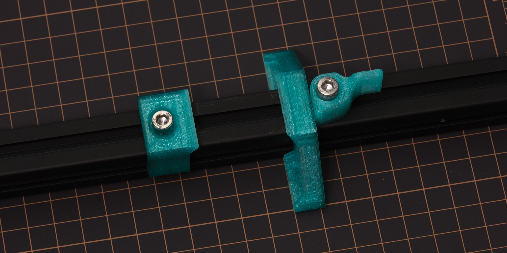
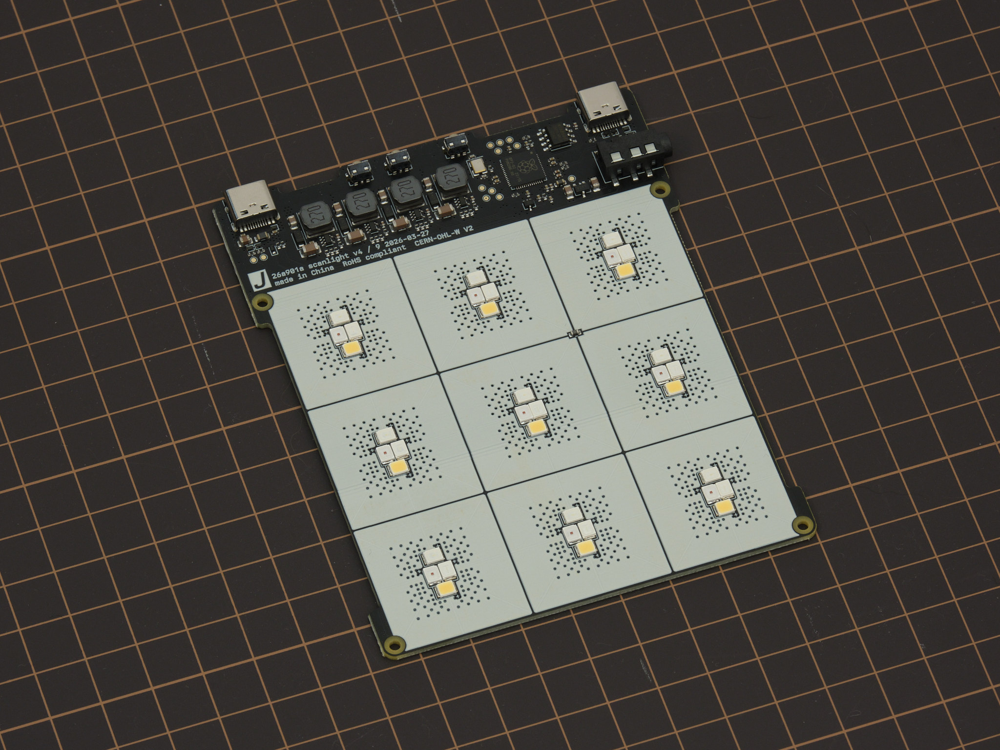
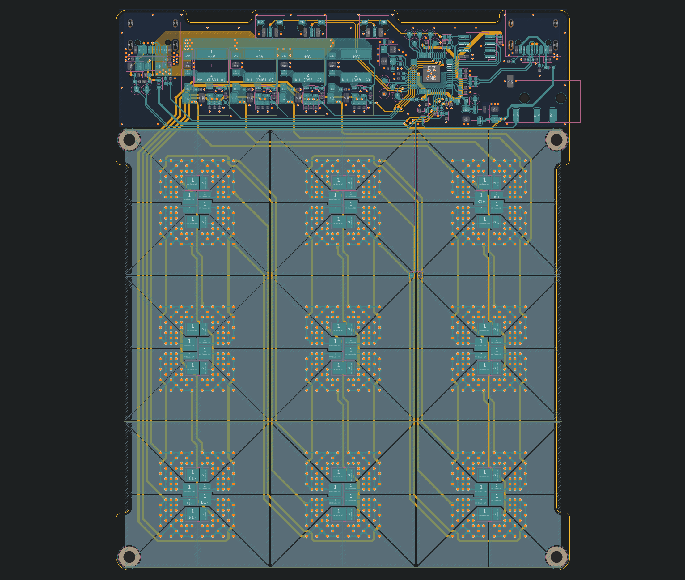

# scanlight v4 info & instructions

## features
* Illuminated area dimensions: 100x76mm (approx. 4x3in)
* Suitable for use with 35mm and medium format film (optimized for 6x7 and smaller sizes)
* Nine each of deep red (665nm), green (525nm), deep blue (455nm), and 5000K 95CRI white LEDs
* Up to 15EV brightness1 in RGB combined mode, 14EV in white mode
* Moderately improved lighting uniformity for medium format over scanlight v2/v3
* Diffuser made from fingerprint- and scratch-resistant textured acrylic
* 3D printed ABS housing
* Fully controllable via USB with [web app](https://jackw01.github.io/scanlight/automation/app_bsl/dist/index.html)
* On/off and mode toggle buttons on light source for standalone usage
* Designed for vertical use with a copy stand or horizontal use with optional threaded insert mounting points
* Adapters available for compatibility with [ToneCarrier](#tonecarrier-adapter) and [Valoi 360 Advancer](https://cinestillfilm.com/products/valoi360-advancer)
* Minimalist 35mm and medium format film carriers available
* Automated camera shutter control for capturing separate red/green/blue images
* Powered using any USB-C power source
* Open source hardware and software

<small>
11/500s at f/8, ISO 100. Direct measurement of the light source (without film.) 
</small> 

Original article on scanning film with narrowband light (with sample scans): *[A Better Light Source For Scanning Color Negative Film](./README.md)*.

## instructions

### basic operation

The light source is powered via the **right USB-C port**. A USB power source that can supply at least 2A at 5V (e.g. almost all USB chargers from the last 10 years) is required.

*It is not recommended to power the light from a USB port on a computer unless the port is marked as a dedicated high-power or charging port; a dedicated USB power supply should be used instead.*

Press the **left button** to toggle the light on and off. Press the **right button** to toggle between narrowband RGB and 95CRI white modes. The buttons work even when the light is not connected to a computer. The default RGB channel brightnesses in this mode can be configured from the GUI, as explained below.

To adjust color and brightness and automate the process of scanning red, green, and blue channels separately, the light source can be connected to a computer via the **left USB-C port** and controlled with the web app located [here](https://jackw01.github.io/scanlight/automation/app_bsl/dist/index.html). The web app requires a Chromium-based web browser.

In the **Manual Control** panel of the web app, the red, green, and blue channel brightnesses can be adjusted and the color channels can be turned on individually or together. In **RGB** (narrowband trichromatic) mode, the red, green, and blue LEDs are on at the same time. In **White** mode, only the 95CRI white LEDs are on. The red, green, and blue LEDs can also be turned on individually; the RGB channel brightness adjustments still apply in this case.

The **RGB Presets** panel of the web app allows RGB channel brightness settings to be stored to and loaded from web browser local storage, using the **Load**, **Create**, **Rename**, and **Delete** buttons.

The **Set as Default** and **Load Default** buttons refer to the default RGB preset, which is stored onboard the light source. This functionality is separate from presets stored in the web app and sets the RGB channel brightnesses used when the light is first powered on and when it is not connected to a computer.

### remote shutter release usage

The **3.5mm jack** can be connected to a camera so that the shutter can be remotely triggered from the web app to automatically capture images for each color channel. The length of the shutter trigger pulse and the delay after are both configurable. The default settings should work for most use cases. Operation in the **R,G,B** mode is shown in the timing diagram below; the other modes work similarly.

A cable with a male 3.5mm plug (otherwise known as a headphone connector) on one end and a camera-specific connector on the other end is required to use this functionality. A wide variety of these cables are available from online retailers; I cannot vouch for the quality of any of them or verify that a specific cable will work, as wiring diagrams are almost never published by the manufacturers. The design has been tested and works with several Fujifilm and Canon cameras that use the 2.5mm microphone jack as the remote shutter release input, with a 3.5mm to 2.5mm cable as well as a standard 3.5mm audio cable and 3.5mm to 2.5mm adapter.

Because the 3.5mm jack is not electrically isolated from the USB ports, it is recommended out of an abundance of caution that the camera should not be connected to the same USB power supply or computer as the light source when using the remote shutter control function. For most cameras, doing so will not cause any issues, but because there is no formal standard for how remote shutter cables or connectors are wired, some cameras may exist that could be damaged by such a setup.

### firmware updates

The web app will automatically notify if a firmware update is available and show a button to put the device into firmware update mode. To manually enter firmware update mode, press and hold down the **DFU mode button** while connecting the **left USB-C port** to a computer. The light source will show up as a USB storage device, and a firmware binary file can be copied to this device to update the firmware.

### cleaning precautions

Cleaning the acrylic diffuser panel with cleaning solutions containing high concentrations of isopropanol, other organic solvents, or ammonia can cause crazing or cracking of the acrylic. If needed, use a cleaner meant for eyeglasses or a diluted household all-purpose cleaner like Simple Green. Do not spray liquids directly on the light source.

## technical details

### dimensions

Note: in order to use up leftover acrylic sheets and bezels from scanlight v3, some of the earliest buyers may receive a light source with the old bezel design, which has an inner opening measuring 100x74mm without the corner "ears" for centering the film carriers and will have magnets installed for attaching the film carriers instead.

### film carrier compatibility

Adapters are available for improved usability with [toneCarrier](https://tonephotographic.com/) and [Valoi 360 Advancer](https://cinestillfilm.com/products/valoi360-advancer) film carriers. Drawings of the adapters with critical dimensions are included below for reference; the dimensions of these third-party film carriers are not published by the manufacturers and are subject to change, so please use these drawings to verify compatibility with your film carriers before buying.

#### toneCarrier 35mm/120 adapter

<small>All dimensions in millimeters.</small>

#### Valoi 360 Advancer adapter

<small>All dimensions in millimeters. Mounting holes are sized for M4 socket head cap screws.</small>

### optical design

Scanlight v4 uses a very simple optical design consisting of a matte white acrylic diffuser panel and a diffusely reflective housing with angled walls and chamfered corners to reduce brightness falloff. Compared to scanlight v2/v3, the light source has been changed from six LED clusters to nine and the diffuser box has been tweaked to sacrifice lighting uniformity outside of the central ~6x7cm area for better brightness and chroma uniformity inside that area. In RGB mode, scanlight v4 has improved lighting uniformity over scanlight v2/v3, and lighting uniformity in both RGB and white modes over the 6x7 image area is similar to big scanlight's lighting uniformity over the 4x5" image area.

### film carriers

The 35mm and medium format film carriers use a double S-curve design to keep the film flat and have a small film-to-light distance (35mm: 2.8mm, medium format: 3.8mm) to minimize vignetting. Both film carriers feature interchangeable masks that snap into the back of the carrier to block stray light from reaching the camera, and the 35mm carrier has a snap-on hood to prevent external light from reflecting off the film. Medium format masks are available in all common sizes, and the film carrier exposes enough area to scan 6x9 negatives when no mask is installed. The double S-curve design is optimized for scanning full rolls or cut pieces >150mm in length; scanning shorter pieces may be difficult especially if the film is curled across its width.

### horizontal mounting

<small>HW v2 shown, v3 and v4 similar.</small>

As an alternative to using a tripod or vertical copy stand, designs for 3D printable parts for mounting the light source and a camera with an Arca-Swiss quick-release plate to a piece of 20x20mm T-slot aluminum extrusion are available. This mounting method accommodates cameras where the distance between the horizontal center plane of the lens and the bottom plane of the quick-release plate is at least 36 mm - the included 3D printable spacers can be used to offset the height of the light source to accommodate larger cameras.

For scanlight v4, horizontal mounting requires an alternate version of the main housing with added mounting bosses as shown below. The layout and size of the mounting bosses is the same as scanlight v2 and v3.

Design files are available [here](https://github.com/jackw01/scanlight/tree/main/3d/horizontal).

### PCBs

Scanlight v4 integrates a RP2040 32-bit ARM Cortex-M0+ microcontroller, four [TPS61169](https://www.ti.com/lit/ds/symlink/tps61169.pdf?ts=1764654827638&ref_url=https%253A%252F%252Fwww.google.com%252F) constant-current boost converters configured for 90mA output current at up to 38V, and an array of 36 2835 mid-power LEDs on a 107.4x87mm four-layer PCB.

All design files for the PCB can be downloaded from the [GitHub repository](https://github.com/jackw01/scanlight/tree/main/pcb/sl_v4).

[scanlight v4 Schematic (PDF)](pcb/sl_v4/sl_v4_20260329.pdf)

[scanlight v4 PCB BOM (CSV)](pcb/sl_v4/sl_v4_20260329.csv)

### mechanical design

STEP files for all parts of the light source, film carrier adapters, and film carriers can be downloaded from the [GitHub repository](https://github.com/jackw01/scanlight/tree/main/3d).

### firmware and web app

The [source code for the RP2040 firmware](https://github.com/jackw01/scanlight/tree/main/automation/firmware_bsl1), a [ready-to-flash firmware binary](https://github.com/jackw01/scanlight/blob/main/automation/sl4_controller_v1.1.uf2), and the [source code for the remote control web app](https://github.com/jackw01/scanlight/tree/main/automation/app_bsl) can be downloaded from the GitHub repository. The firmware is implemented using the RP2040 SDK and the web app is made with [Vue](https://github.com/vuejs) and [Vuetify](https://github.com/vuetifyjs/vuetify).

Interested in building your own control software? The USB serial communication interface used by the firmware is fully documented [here](https://github.com/jackw01/scanlight/blob/main/automation/bsl_control_interface.md).

### license

The PCB schematic, layout, and Gerber files and the 3D CAD files for this project are released under the [CERN Open Hardware Licence Version 2 - Weakly Reciprocal](https://choosealicense.com/licenses/cern-ohl-w-2.0/) (CERN-OHL-W V2). Software and firmware are released under the MIT License.

